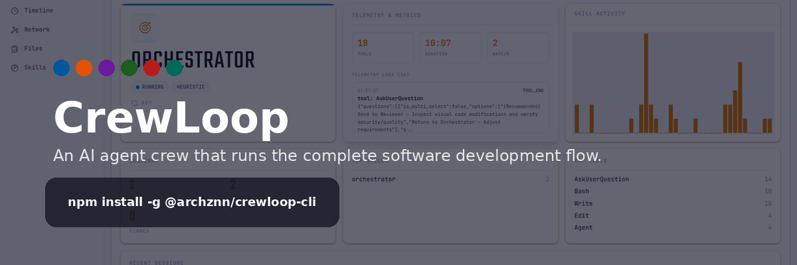
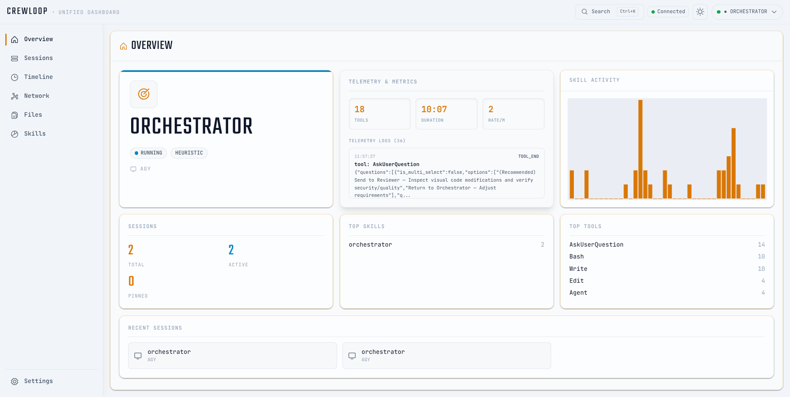
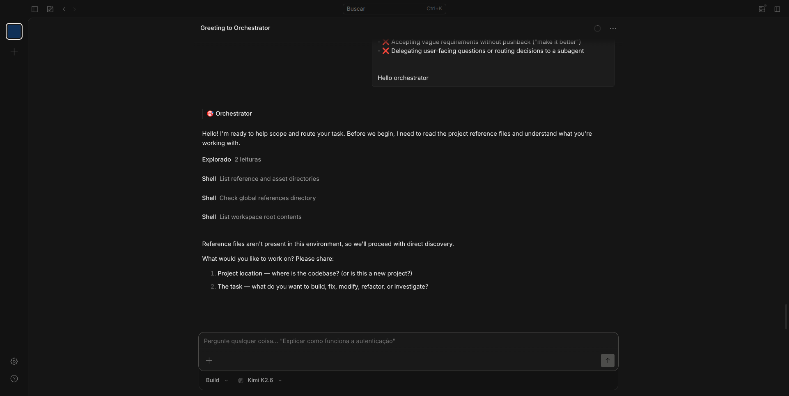
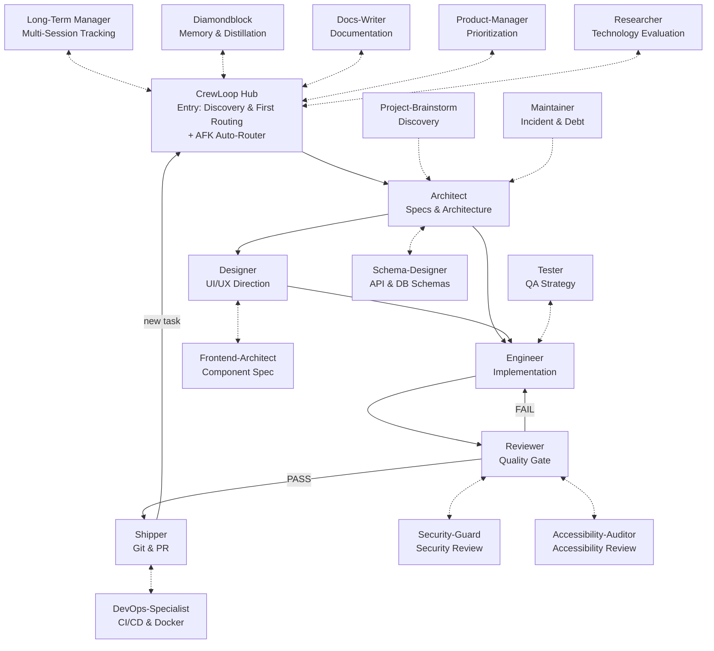

# CrewLoop



[](https://www.npmjs.com/package/@archznn/crewloop-skills)
[](LICENSE.md)
[](https://github.com/leorsousa05/CrewLoop/actions/workflows/validate.yml)
[](https://leorsousa05.github.io/CrewLoop/)

CrewLoop is a documentation-first framework of role-based AI skills. Each skill is a self-contained `SKILL.md` instruction set that agents load and follow, enforcing a structured workflow across discovery, architecture, design, implementation, review, and shipping.

## Highlights

- **Process-driven workflow:** CrewLoop Hub, Architect, Designer, Engineer, Reviewer, Shipper, and thirteen supporting roles each own one phase and never invade another's territory.
- **Mandatory specs:** Every change, from a one-line fix to a full feature, gets a lightweight spec in `specs/changes/` before implementation starts.
- **Design before code:** When there is UI, the Designer defines the aesthetic direction before the Engineer writes markup or styles.
- **Docs by docs-writer:** READMEs, module docs, and changelogs are owned by the docs-writer skill so the engineer can focus on code and tests.
- **Quality gate:** The Reviewer inspects every diff for spec compliance, security, performance, and AI artifacts before anything reaches the repository.
- **Conventional Commits:** The Shipper generates commit messages, branches, archives specs, and opens PRs following the Conventional Commits standard.

## Quick Start

Install the CLI globally and load the full crew:

```bash
npm install -g @archznn/crewloop-cli
crewloop install
```

Install only the skills you need:

```bash
crewloop install --skill architect --skill engineer
```

Install to a custom directory or for another supported agent:

```bash
crewloop install --target /path/to/your/skills/dir
crewloop install --agent claude
```

Validate that all skills are well-formed:

```bash
python scripts/validate-skills.py
```

Each skill is automatically detected and activated according to the conversation context.

## CLI Reference & Options

The `crewloop` CLI provides commands to manage skills and integrate them with your AI coding agents.

### Commands

| Command | Description |
| :--- | :--- |
| `crewloop install` | Installs the CrewLoop skills to your local environment. |
| `crewloop list` | Lists all installed skills and active hooks. |
| `crewloop dashboard` | Launches the real-time WebSocket dashboard. |

### Global Flags for `crewloop install`

| Flag | Description |
| :--- | :--- |
| `--symlink` | Symbolically link skills instead of copying them (ideal for development). |
| `--force` | Overwrite existing skill configurations or hooks without asking. |
| `--dry-run` | Output the installation steps without modifying any files. |
| `--agent <name>` | Configure hooks for a specific agent (e.g., `kimi`, `claude`, `codex`, `agy`). |
| `--target <path>` | Specify a custom destination path for the skills. |
| `--skill <name>` | Install only a specific skill (can be specified multiple times). |
| `--diamondblock` | Opt-in: delegate DiamondBlock MCP registration to the separately installed official DiamondBlock CLI. |

> [!NOTE]
> **DiamondBlock is opt-in.** `crewloop install` never touches MCP configuration. To activate the optional DiamondBlock integration, install the official DiamondBlock CLI separately (for example `npm i -g diamondblock`) and run `crewloop install --diamondblock`, which delegates MCP registration to the official installer. Installing the DiamondBlock skill (Markdown instructions) is not the same as configuring or activating its MCP server. `crewloop doctor` reports DiamondBlock readiness as optional warnings, never errors.

## Real-time Activity Dashboard

The dashboard provides a real-time WebSocket visualization of active skills, tool-use events, and execution logs.



By default, the dashboard binds to `http://127.0.0.1:7890`. You can change this port by setting the `CREWLOOP_DASHBOARD_PORT` environment variable.

### Running the Dashboard

You can start the dashboard using the CLI:
```bash
crewloop dashboard
```

Alternatively, you can run it from the source:
```bash
cd servers/dashboard
npm install
npm run dev
```

### Keyboard Shortcuts
- **`Cmd/Ctrl + K`**: Opens the command palette to search events, switch sessions, or manage active skills.

## Supported Agents & Hooks

CrewLoop supports native shimming/hooking for the following AI agents:
- **Kimi Code** (`kimi`)
- **Claude** (`claude`)
- **Codex** (`codex`)
- **AGY** (`agy`)
- **OpenCode** (`opencode`)

During `crewloop install`, the installer modifies the configuration or custom scripts of the selected agent. This shims their execution, allowing tool execution events (such as read/write file, run command, etc.) to be forwarded to the local dashboard WebSocket.

## Meet the Crew

CrewLoop ships 19 specialist skills. The core crew owns the main delivery loop; the supporting crew jumps in when the context demands it.

### Core Crew

| Skill | Phase | Responsibility |
|-------|-------|----------------|
| <span style="background:#01579B;color:#fff;padding:2px 8px;border-radius:9999px;">CrewLoop Hub</span> | Discovery | Context gathering, requirement clarification, and routing |
| <span style="background:#E65100;color:#fff;padding:2px 8px;border-radius:9999px;">Architect</span> | Specs | Spec creation, architecture design, and contracts |
| <span style="background:#6A1B9A;color:#fff;padding:2px 8px;border-radius:9999px;">Designer</span> | Design | UI/UX aesthetic direction and design specs |
| <span style="background:#1B5E20;color:#fff;padding:2px 8px;border-radius:9999px;">Engineer</span> | Build | Implementation, tests, and verification |
| <span style="background:#B71C1C;color:#fff;padding:2px 8px;border-radius:9999px;">Reviewer</span> | Review | Code review, quality gate, and security scan |
| <span style="background:#00695C;color:#fff;padding:2px 8px;border-radius:9999px;">Shipper</span> | Ship | Git commit, branch creation, push, and PR |

### Supporting Crew

| Skill | Phase | Responsibility |
|-------|-------|----------------|
| [`project-brainstorm`](skills/project-brainstorm/SKILL.md) | Brainstorm | Discovery for new or ambiguous project ideas |
| [`long-term-manager`](skills/long-term-manager/SKILL.md) | Tracking | Durable tracking for projects that span multiple sessions |
| [`diamondblock`](skills/diamondblock/SKILL.md) | Memory | Managing multi-session memory, retrieving context, searching knowledge, or logging session histories |
| [`docs-writer`](skills/docs-writer/SKILL.md) | Docs | Documentation, READMEs, and changelogs |
| [`tester`](skills/tester/SKILL.md) | QA | Test strategy, coverage analysis, and test plans |
| [`product-manager`](skills/product-manager/SKILL.md) | Product | Prioritization, roadmap, and success metrics |
| [`maintainer`](skills/maintainer/SKILL.md) | Upkeep | Bug triage, technical debt, and incidents |
| [`researcher`](skills/researcher/SKILL.md) | Research | Technology evaluation and proof-of-concepts |
| [`security-guard`](skills/security-guard/SKILL.md) | Security Review | Security review, secret scanning, and auth |
| [`accessibility-auditor`](skills/accessibility-auditor/SKILL.md) | Accessibility Review | WCAG, screen reader, and keyboard navigation review |
| [`frontend-architect`](skills/frontend-architect/SKILL.md) | Frontend Architecture | Component boundaries, props, slots, and state ownership |
| [`schema-designer`](skills/schema-designer/SKILL.md) | Schema Design | Relational schemas, migrations, and API contracts |
| [`devops-specialist`](skills/devops-specialist/SKILL.md) | DevOps | CI/CD, deployment, containers, and infrastructure validation |

### Skills in Action



## Workflow (Direct Routing)

Skills hand off directly to the next skill via their ending menu; the user confirms each
transition. The CrewLoop Hub mediates only as the entry point for new tasks and as the
automatic router in AFK mode.



**Flow rules:**

> [!IMPORTANT]
> **Core Routing Rule:** Skills route directly to the next skill per the transition contract in `references/conventions.md`. The CrewLoop Hub mediates only at task entry and in AFK mode.

1. **CrewLoop Hub is the entry point** — it may invoke approved discovery/tracking helpers, then routes to Architect as the first mandatory delivery phase.
2. **Architect is mandatory before implementation** — Hub never routes directly to Designer or Engineer.
3. **Architect is the design gatekeeper** — once the spec is created, it recommends Designer (for UI) or Engineer (for code).
4. **Designer acts before Engineer** — when there is UI, the Designer creates the visual specification before the Engineer implements.
5. **Engineer never does git, review, or docs** — it implements code and tests, then its menu recommends the Reviewer.
6. **Reviewer is the quality gate** — no code reaches the repository without review. PASS recommends Shipper; FAIL recommends Engineer.
7. **Shipper is the only skill that touches git** — commit, branch, push, and PR. After shipping it offers a new task (CrewLoop Hub) or done.
8. **Sub-skills assist core skills** — supporting skills return to their invoker, except completed Project Brainstorm briefs and confirmed Maintainer bugs, which route to Architect.
9. **Specs are archived** — the `specs/changes/` folder is moved to `specs/archive/` on commit.
10. **Bug-fixing Pipeline** — Bug triaging is handled by the Maintainer, who recommends the Architect to create a lightweight specification (`.spec.yaml` + `tasks.md`), then the standard chain applies: Engineer → Reviewer → Shipper (commit/ship and archive the spec).
11. **AFK mode is the exception** — every non-Hub skill returns control to CrewLoop Hub, which loads the next skill without menus.

> [!NOTE]
> **Standard Developer Cycle Example:**
> `CrewLoop Hub` (Discovery) -> `Architect` (Spec creation) -> `Engineer` (Build & Tests) -> `Reviewer` (Quality gate check) -> `Shipper` (Git commit & PR) -> done. Interactive transitions are confirmed through menus; Architect and Designer hand off automatically.


## Repository Layout

```text
crewloop/
├── skills/                # Role-based SKILL.md instructions
├── packages/cli/          # npm-published CLI installer
├── servers/dashboard/     # Real-time WebSocket dashboard
├── docs/                  # Docusaurus documentation site
├── references/            # Shared conventions and workflow reference
├── scripts/               # Validation and packaging helpers
└── specs/                 # Active, archived, and living specs
```

## Adding a New Skill

1. Copy [`assets/templates/skill-template.md`](assets/templates/skill-template.md) to `skills/<skill-name>/SKILL.md`.
2. Fill in the YAML frontmatter and role instructions.
3. Add the skill to the README tables if it is user-facing.
4. Run `python scripts/validate-skills.py`.
5. Open a PR; the Reviewer validates structure and the Shipper archives the spec.

## Releasing

Versions are published automatically from `main`:

1. The Shipper bumps the version in `package.json` (and workspace manifests) following semver.
2. Merging to `main` triggers `.github/workflows/release-tag.yml`, which creates a `vX.Y.Z` tag.
3. `.github/workflows/publish-npm.yml` publishes `@archznn/crewloop-skills` to npm.

Manual releases are not required.

## Contributing

Edit the files in `skills/` and `references/`. Keep each `SKILL.md` concise and use reference files for shared detail. Run `python scripts/validate-skills.py` before opening a PR. For the full workflow, see [`references/workflow.md`](references/workflow.md).

## License

[MIT](LICENSE.md)
