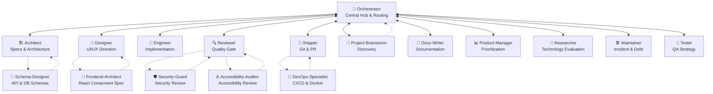

# CrewLoop

An AI agent crew that runs the complete software development flow — from discovery to deploy — with clear roles, mandatory specs, and no skipped steps.

[](https://leorsousa05.github.io/CrewLoop/)
[](LICENSE.md)
[](#whats-in-the-box)
[](scripts/validate-skills.py)

📚 **Read the full documentation at [leorsousa05.github.io/CrewLoop](https://leorsousa05.github.io/CrewLoop/)**

## Highlights

- **Process-driven workflow:** Orchestrator, Architect, Designer, Engineer, Reviewer, Shipper, Project-Brainstorm, Docs-Writer, Tester, Product-Manager, Maintainer, Researcher, Security-Guard, and Accessibility-Auditor each own one phase and never invade another's territory.
- **Mandatory specs:** Every change, from a one-line bug fix to a full feature, gets a lightweight spec in `specs/` before implementation starts.
- **Design before code:** When there is a UI, the Designer defines the aesthetic direction before the Engineer writes a single line of HTML or CSS.
- **Docs by docs-writer:** READMEs, module docs, feature docs, and changelogs are owned by the docs-writer skill — the engineer focuses on code and tests.
- **Quality gate:** The Reviewer inspects every diff for spec compliance, security, performance, and AI artifacts before anything reaches the repository.
- **Conventional Commits:** The Shipper generates commit messages, branches, archives specs, and prepares PRs following the Conventional Commits standard.

## Quick Start

```bash
npm install -g @archznn/crewloop-cli
crewloop install
```

Install only the skills you need:

```bash
crewloop install --skill architect --skill engineer
```

Install to a custom directory or for another agent:

```bash
crewloop install --target /path/to/your/skills/dir
crewloop install --agent claude
```

Validate that all skills are well-formed:

```bash
python scripts/validate-skills.py
```

Each skill will be automatically detected and activated according to the conversation context.

## What's in the Box?

### Core Crew

| Skill | Emoji | Phase | Learn more |
|-------|-------|-------|------------|
| [`orchestrator`](skills/orchestrator/SKILL.md) | 🎯 | Discovery | [Docs](https://leorsousa05.github.io/CrewLoop/docs/core/orchestrator) |
| [`architect`](skills/architect/SKILL.md) | 🏗️ | Specs | [Docs](https://leorsousa05.github.io/CrewLoop/docs/core/architect) |
| [`designer`](skills/designer/SKILL.md) | 🎨 | Design | [Docs](https://leorsousa05.github.io/CrewLoop/docs/core/designer) |
| [`engineer`](skills/engineer/SKILL.md) | 🔧 | Build | [Docs](https://leorsousa05.github.io/CrewLoop/docs/core/engineer) |
| [`reviewer`](skills/reviewer/SKILL.md) | 🔍 | Review | [Docs](https://leorsousa05.github.io/CrewLoop/docs/core/reviewer) |
| [`shipper`](skills/shipper/SKILL.md) | 🚀 | Ship | [Docs](https://leorsousa05.github.io/CrewLoop/docs/core/shipper) |

### Supporting Crew

| Skill | Emoji | Phase | Learn more |
|-------|-------|-------|------------|
| [`project-brainstorm`](skills/project-brainstorm/SKILL.md) | 🧠 | Brainstorm | [Docs](https://leorsousa05.github.io/CrewLoop/docs/supporting/project-brainstorm) |
| [`docs-writer`](skills/docs-writer/SKILL.md) | 📝 | Docs | [Docs](https://leorsousa05.github.io/CrewLoop/docs/supporting/docs-writer) |
| [`tester`](skills/tester/SKILL.md) | 🧪 | QA | [Docs](https://leorsousa05.github.io/CrewLoop/docs/supporting/tester) |
| [`product-manager`](skills/product-manager/SKILL.md) | 📊 | Product | [Docs](https://leorsousa05.github.io/CrewLoop/docs/supporting/product-manager) |
| [`maintainer`](skills/maintainer/SKILL.md) | 🛠️ | Upkeep | [Docs](https://leorsousa05.github.io/CrewLoop/docs/supporting/maintainer) |
| [`researcher`](skills/researcher/SKILL.md) | 🔬 | Research | [Docs](https://leorsousa05.github.io/CrewLoop/docs/supporting/researcher) |
| [`security-guard`](skills/security-guard/SKILL.md) | 🛡️ | Security Review | [Docs](https://leorsousa05.github.io/CrewLoop/docs/supporting/security-guard) |
| [`accessibility-auditor`](skills/accessibility-auditor/SKILL.md) | ♿ | Accessibility Review | [Docs](https://leorsousa05.github.io/CrewLoop/docs/supporting/accessibility-auditor) |

## Workflow (Hub-and-Spoke)

All execution skills return control to the Orchestrator. The Orchestrator manages the task state and handles all routing decisions.



**Flow rules:**

1. **Orchestrator is the Central Hub** — every agent hands control back to Orchestrator at the end of their turn.
2. **Orchestrator always routes to Architect first** — to create or update specifications.
3. **Architect is the design gatekeeper** — once the spec is created, control returns to Orchestrator, which routes to Designer (for UI) or Engineer (for code).
4. **Designer acts before Engineer** — when there is UI, the designer creates the visual specification before the engineer implements, returning control to Orchestrator in between.
5. **Engineer never does git, review, or docs** — implements code and returns to Orchestrator, which routes to Reviewer.
6. **Reviewer is the quality gate** — no code reaches the repository without review.
7. **Shipper is the only one who touches git** — commit, branch, push, PR.
8. **Sub-skills assist core skills** — `project-brainstorm` helps `orchestrator` with discovery for new or ambiguous projects; `schema-designer` helps `architect`; `frontend-architect` helps `designer`; and `devops-specialist` helps `shipper`.
9. **Specs are archived** — `specs/changes/` folder is moved to `specs/archive/` on commit.

## Adding a New Skill

1. Copy the template:

```bash
cp assets/templates/skill-template.md skills/<skill-name>/SKILL.md
```

2. Fill in the frontmatter and body following [`references/skill-anatomy.md`](references/skill-anatomy.md).

3. Run the validator:

```bash
python scripts/validate-skills.py
```

4. Follow the full team workflow (hub-and-spoke star routing via Orchestrator) to integrate it.

## Repository Layout

```
CrewLoop/
├── skills/                    # All 14 team skills
│   ├── orchestrator/
│   ├── architect/
│   └── ...
├── scripts/                   # Helper scripts
│   ├── validate-skills.py
│   ├── package-skill.py
│   └── npm-publish-dry-run.sh
├── servers/                   # Runtime servers
│   ├── dashboard/             # Real-time skill dashboard
│   └── obsidian-mcp/          # Obsidian MCP server (Python, experimental)
├── references/                # Shared conventions and workflow docs
│   ├── conventions.md
│   ├── skill-anatomy.md
│   └── workflow.md
├── docs/                      # Docusaurus documentation site
├── specs/                     # Spec-driven change records
│   ├── changes/
│   ├── archive/
│   ├── living/
│   └── decisions/
├── assets/                    # Templates and static assets
│   └── templates/
│       └── skill-template.md
└── tests/                     # Manual testing notes
    └── README.md
```

## Releasing

Packages are published automatically by GitHub Actions when a semantic-version tag is pushed.

1. Make sure `package.json` and `packages/cli/package.json` versions are updated and aligned.
2. Make sure `packages/cli/package.json` depends on `@archznn/crewloop-skills` with `^<version>`.
3. Create and push a tag:

```bash
git tag v0.8.0
git push origin v0.8.0
```

The workflow will:

- Validate that the tag matches both `package.json` versions and the CLI dependency.
- Publish `@archznn/crewloop-skills`.
- Wait until the new version is visible on npm.
- Publish `@archznn/crewloop-cli`.

You need an npm automation token with publish rights for the `@archznn` scope configured as the `NPM_TOKEN` repository secret.

## Contributing

Edit the files in `skills/` and `references/`. Keep each `SKILL.md` concise and use reference files for shared detail. Run `python scripts/validate-skills.py` before opening a PR.

## License

[MIT](LICENSE.md)
