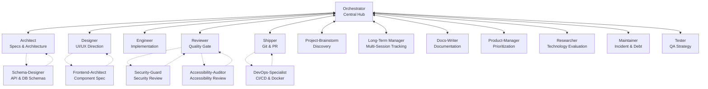

# CrewLoop

An AI agent crew that runs the complete software development flow — from discovery to deploy — with clear roles, mandatory specs, and no skipped steps.

[](https://www.npmjs.com/package/@archznn/crewloop-skills)
[](LICENSE.md)
[](https://github.com/leorsousa05/CrewLoop/actions/workflows/validate.yml)
[](https://leorsousa05.github.io/CrewLoop/)

CrewLoop is a documentation-first framework of role-based AI skills. Each skill is a self-contained `SKILL.md` instruction set that agents load and follow, enforcing a structured workflow across discovery, architecture, design, implementation, review, and shipping.

## Highlights

- **Process-driven workflow:** Orchestrator, Architect, Designer, Engineer, Reviewer, Shipper, and nine supporting roles each own one phase and never invade another's territory.
- **Mandatory specs:** Every change, from a one-line fix to a full feature, gets a lightweight spec in `specs/changes/` before implementation starts.
- **Design before code:** When there is UI, the Designer defines the aesthetic direction before the Engineer writes markup or styles.
- **Docs by docs-writer:** READMEs, module docs, and changelogs are owned by the docs-writer skill so the engineer can focus on code and tests.
- **Quality gate:** The Reviewer inspects every diff for spec compliance, security, performance, and AI artifacts before anything reaches the repository.
- **Conventional Commits:** The Shipper generates commit messages, branches, archives specs, and opens PRs following the Conventional Commits standard.

## Quick Start

Install the CLI globally and load the full crew:

```bash
npm install -g @archznn/crewloop-cli
crewloop install
```

Install only the skills you need:

```bash
crewloop install --skill architect --skill engineer
```

Install to a custom directory or for another supported agent:

```bash
crewloop install --target /path/to/your/skills/dir
crewloop install --agent claude
```

Validate that all skills are well-formed:

```bash
python scripts/validate-skills.py
```

Each skill is automatically detected and activated according to the conversation context.

## What's in the Box?

### Core Crew

| Skill | Phase | Responsibility |
|-------|-------|----------------|
| [`orchestrator`](skills/orchestrator/SKILL.md) | Discovery | Context gathering, requirement clarification, and routing |
| [`architect`](skills/architect/SKILL.md) | Specs | Spec creation, architecture design, and contracts |
| [`designer`](skills/designer/SKILL.md) | Design | UI/UX aesthetic direction and design specs |
| [`engineer`](skills/engineer/SKILL.md) | Build | Implementation, tests, and verification |
| [`reviewer`](skills/reviewer/SKILL.md) | Review | Code review, quality gate, and security scan |
| [`shipper`](skills/shipper/SKILL.md) | Ship | Git commit, branch creation, push, and PR |

### Supporting Crew

| Skill | Phase | Responsibility |
|-------|-------|----------------|
| [`project-brainstorm`](skills/project-brainstorm/SKILL.md) | Brainstorm | Discovery for new or ambiguous project ideas |
| [`long-term-manager`](skills/long-term-manager/SKILL.md) | Tracking | Durable tracking for projects that span multiple sessions |
| [`docs-writer`](skills/docs-writer/SKILL.md) | Docs | Documentation, READMEs, and changelogs |
| [`tester`](skills/tester/SKILL.md) | QA | Test strategy, coverage analysis, and test plans |
| [`product-manager`](skills/product-manager/SKILL.md) | Product | Prioritization, roadmap, and success metrics |
| [`maintainer`](skills/maintainer/SKILL.md) | Upkeep | Bug triage, technical debt, and incidents |
| [`researcher`](skills/researcher/SKILL.md) | Research | Technology evaluation and proof-of-concepts |
| [`security-guard`](skills/security-guard/SKILL.md) | Security Review | Security review, secret scanning, and auth |
| [`accessibility-auditor`](skills/accessibility-auditor/SKILL.md) | Accessibility Review | WCAG, screen reader, and keyboard navigation review |

## Workflow (Hub-and-Spoke)

All execution skills return control to the Orchestrator, which manages task state and handles routing decisions.



**Flow rules:**

1. **Orchestrator is the central hub** — every skill hands control back to Orchestrator at the end of its turn.
2. **Orchestrator always routes to Architect first** — to create or update specifications.
3. **Architect is the design gatekeeper** — once the spec is created, control returns to Orchestrator, which routes to Designer (for UI) or Engineer (for code).
4. **Designer acts before Engineer** — when there is UI, the Designer creates the visual specification before the Engineer implements.
5. **Engineer never does git, review, or docs** — it implements code and tests, then returns to Orchestrator.
6. **Reviewer is the quality gate** — no code reaches the repository without review.
7. **Shipper is the only skill that touches git** — commit, branch, push, and PR.
8. **Sub-skills assist core skills** — `project-brainstorm` helps `orchestrator`; `schema-designer` helps `architect`; `frontend-architect` helps `designer`; and `devops-specialist` helps `shipper`.
9. **Specs are archived** — the `specs/changes/` folder is moved to `specs/archive/` on commit.

## Repository Layout

```text
crewloop/
├── skills/                # Role-based SKILL.md instructions
├── packages/cli/          # npm-published CLI installer
├── servers/dashboard/     # Real-time WebSocket dashboard
├── servers/obsidian-mcp/  # Obsidian MCP bridge
├── docs/                  # Docusaurus documentation site
├── references/            # Shared conventions and workflow reference
├── scripts/               # Validation and packaging helpers
└── specs/                 # Active, archived, and living specs
```

## Adding a New Skill

1. Copy [`assets/templates/skill-template.md`](assets/templates/skill-template.md) to `skills/<skill-name>/SKILL.md`.
2. Fill in the YAML frontmatter and role instructions.
3. Add the skill to the README tables if it is user-facing.
4. Run `python scripts/validate-skills.py`.
5. Open a PR; the Reviewer validates structure and the Shipper archives the spec.

## Releasing

Versions are published automatically from `main`:

1. The Shipper bumps the version in `package.json` (and workspace manifests) following semver.
2. Merging to `main` triggers `.github/workflows/release-tag.yml`, which creates a `vX.Y.Z` tag.
3. `.github/workflows/publish-npm.yml` publishes `@archznn/crewloop-skills` to npm.

Manual releases are not required.

## Contributing

Edit the files in `skills/` and `references/`. Keep each `SKILL.md` concise and use reference files for shared detail. Run `python scripts/validate-skills.py` before opening a PR. For the full workflow, see [`references/workflow.md`](references/workflow.md).

## License

[MIT](LICENSE.md)
