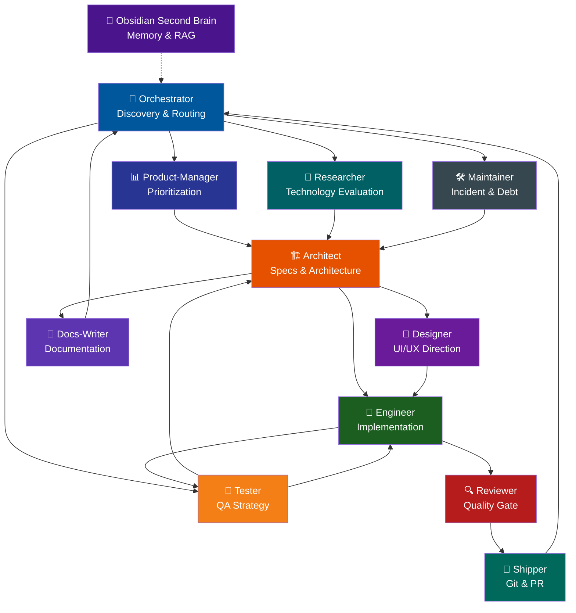

# Loop Engineering Agents

A team of AI skills that work together as a complete software development flow — from requirements discovery to deploy — ensuring no step is skipped and every change is traceable.

- **Process-driven workflow:** Orchestrator, Architect, Designer, Engineer, Reviewer, Shipper, Docs-Writer, Tester, Product-Manager, Maintainer, and Researcher each own one phase and never invade another's territory.
- **Mandatory specs:** Every change, from a one-line bug fix to a full feature, gets a lightweight spec in `specs/` before implementation starts.
- **Design before code:** When there is a UI, the Designer defines the aesthetic direction before the Engineer writes a single line of HTML or CSS.
- **Quality gate:** The Reviewer inspects every diff for spec compliance, security, performance, and AI artifacts before anything reaches the repository.
- **Conventional Commits:** The Shipper generates commit messages, branches, and PRs following the Conventional Commits standard with archived specs.

## Quick Start

1. Clone the repository:

```bash
git clone https://github.com/leorsousa05/loop-engineering-agents.git
cd loop-engineering-agents
```

2. Install all skills to your agent's skills directory:

```bash
./scripts/install.sh
```

By default this copies `skills/*` to `~/.agents/skills/`. Pass a custom target if needed:

```bash
./scripts/install.sh /path/to/your/skills/dir
```

3. Validate that all skills are well-formed:

```bash
python scripts/validate-skills.py
```

Each skill will be automatically detected and activated according to the conversation context.

## Obsidian Second Brain (MCP)

This repository also includes an optional MCP server that turns a local Obsidian vault (`~/.lea`) into a second brain / RAG for AI agents.

- [`servers/obsidian-mcp/README.md`](servers/obsidian-mcp/README.md) — installation and configuration
- [`references/obsidian-mcp-usage.md`](references/obsidian-mcp-usage.md) — how agents/skills should use it

## Skills

| Skill | Phase | What it does |
|-------|-------|-------------|
| [`orchestrator`](skills/orchestrator/SKILL.md) | Discovery | Collects context, clarifies requirements, and routes every task to the architect first. |
| [`architect`](skills/architect/SKILL.md) | Specs | Creates mandatory specs, contracts, and ADRs in `specs/` before any code is written. |
| [`designer`](skills/designer/SKILL.md) | Design | Defines bold aesthetic direction, color systems, typography, and motion specs for UI work. |
| [`engineer`](skills/engineer/SKILL.md) | Build | Implements specs with tests, handles errors, and verifies builds — never touches git or review. |
| [`reviewer`](skills/reviewer/SKILL.md) | Review | Audits diffs for quality, security, performance, and spec compliance before shipping. |
| [`shipper`](skills/shipper/SKILL.md) | Ship | Commits with Conventional Commits, creates branches, archives specs, and prepares PRs. |
| [`docs-writer`](skills/docs-writer/SKILL.md) | Docs | Writes and rewrites project documentation, READMEs, module docs, and feature docs tailored to the project type. |
| [`obsidian-second-brain`](skills/obsidian-second-brain/SKILL.md) | Memory | Uses the local Obsidian MCP server to retrieve prior knowledge and persist new concepts/decisions automatically. |
| [`tester`](skills/tester/SKILL.md) | QA | Designs test strategies, identifies missing coverage, and reproduces bugs. |
| [`product-manager`](skills/product-manager/SKILL.md) | Product | Frames requirements in terms of user value, success metrics, and prioritization. |
| [`maintainer`](skills/maintainer/SKILL.md) | Upkeep | Diagnoses issues, classifies technical debt, and plans dependency updates. |
| [`researcher`](skills/researcher/SKILL.md) | Research | Evaluates technologies, compares alternatives, and runs proofs of concept. |

## Workflow



**Flow rules:**

1. **Orchestrator always sends to Architect first** — never directly to Designer, Engineer, or Docs-Writer. Optional pre-routing to Product-Manager, Researcher, Maintainer, or Tester is allowed.
2. **Architect is the gatekeeper** — creates specs and decides whether to route to Designer (UI/frontend), Engineer (backend/code), or Docs-Writer (documentation).
3. **Designer acts before Engineer** — when there is UI, the designer creates the visual specification before the engineer implements.
4. **Engineer never does git or review** — reviewer and shipper handle those.
5. **Reviewer is the quality gate** — no code reaches the repository without review.
6. **Shipper is the only one who touches git** — commit, branch, push, PR.
7. **Docs-Writer produces documentation** — READMEs, module docs, feature docs. Called by orchestrator when the task is purely documentation.
8. **Tester designs QA strategy** — reviews coverage, reproduces bugs, and complements engineer tests.
9. **Product-Manager, Researcher, and Maintainer are optional advisors** — framing, technology evaluation, and upkeep before or alongside the core flow.
10. **Specs are archived** — `specs/changes/` becomes `specs/archive/` on commit.
11. **All skills return to orchestrator** — it is the central hub.

## Adding a New Skill

1. Copy the template:

```bash
cp assets/templates/skill-template.md skills/<skill-name>/SKILL.md
```

2. Fill in the frontmatter and body following [`references/skill-anatomy.md`](references/skill-anatomy.md).

3. Run the validator:

```bash
python scripts/validate-skills.py
```

4. Follow the full team workflow (orchestrator → architect → engineer → reviewer → shipper) to integrate it.

## Repository Layout

```
loop-engineering-agents/
├── skills/                    # All team skills
│   ├── orchestrator/
│   ├── architect/
│   ├── designer/
│   ├── engineer/
│   ├── reviewer/
│   ├── shipper/
│   ├── docs-writer/
│   ├── obsidian-second-brain/
│   ├── tester/
│   ├── product-manager/
│   ├── maintainer/
│   └── researcher/
├── servers/                   # Optional MCP servers
│   └── obsidian-mcp/          # Local Obsidian second-brain server
├── scripts/                   # Helper scripts
│   ├── install.sh
│   ├── validate-skills.py
│   └── package-skill.py
├── references/                # Shared conventions and workflow docs
│   ├── conventions.md
│   ├── skill-anatomy.md
│   ├── workflow.md
│   └── obsidian-mcp-usage.md
├── specs/                     # Spec-driven change records
│   ├── changes/
│   ├── archive/
│   ├── living/
│   └── decisions/
├── assets/                    # Templates and static assets
│   └── templates/
│       └── skill-template.md
└── tests/                     # Manual testing notes
    └── README.md
```

## Contributing

Edit the files in `skills/` and `references/`. Keep each `SKILL.md` concise and use reference files for shared detail. Run `python scripts/validate-skills.py` before opening a PR.

## License

[MIT](LICENSE.md)
