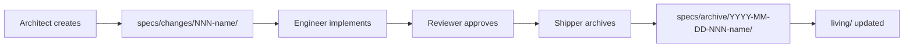

# Specs

A **spec** is the source of truth for a change. Every task, including 1-line bug fixes, gets a spec before any code is written. No exceptions.

## Why specs exist

Without a spec, the Engineer does not know what to build, the Reviewer cannot verify compliance, and the team cannot trace why a decision was made six months later. Specs make the workflow auditable and the implementation unambiguous.

## Spec folder structure

```
specs/
├── changes/                    # Active in-progress specs
│   └── NNN-name/               # One folder per change
│       ├── .spec.yaml          # Status, dates, author, affected files
│       ├── proposal.md         # WHY — motivation, scope, constraints
│       ├── specs/              # WHAT — delta vs. current system
│       ├── design.md           # HOW — models, APIs, data flows, contracts
│       └── tasks.md            # Ordered implementation checklist
├── archive/                    # Completed specs (prefixed YYYY-MM-DD-NNN-name)
├── living/                     # Merged source of truth per subsystem
└── decisions/                  # Architectural Decision Records (ADRs)
```

## When to create a spec

| Change size | Required files |
|------------|----------------|
| Bug fix / tweak (< 10 lines) | `.spec.yaml` + `tasks.md` |
| Feature / component | Full spec: all five files |
| Multi-component / architectural | Full spec + ADR in `decisions/` |

**Every spec file must live inside `specs/changes/NNN-name/`. Never place spec files directly in `specs/`.**

## What each file contains

### `.spec.yaml`
Metadata: status (`in-progress`, `done`), created date, author, affected files, skills involved.

### `proposal.md`
The **why**: motivation for the change, scope (what is in and out), and constraints the implementation must respect.

### `specs/spec.md`
The **what**: a delta view of the current system vs. the desired system. Acceptance criteria and edge cases.

### `design.md`
The **how**: TypeScript interfaces, API contracts, data flows, component breakdowns. Formal enough that an engineer can implement without asking questions.

### `tasks.md`
An ordered checklist of implementation steps. The Engineer checks off tasks as they complete them.

## Spec lifecycle


