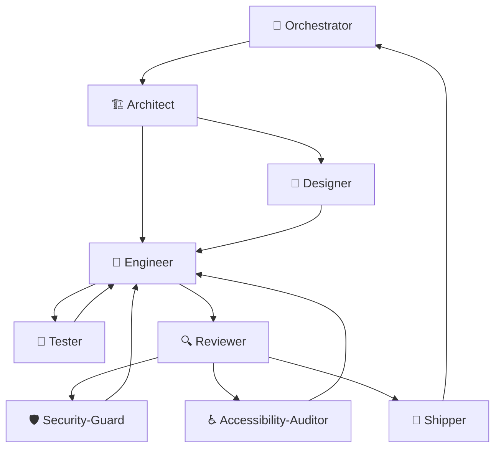

# The Workflow

## The canonical flow

## Mandatory routing rules

1. **Orchestrator always routes to Architect first.** Never directly to Designer, Engineer, or Docs-Writer.
2. **Architect creates a spec** in `specs/changes/NNN-name/` for every change, including 1-line bug fixes.
3. **Designer acts before Engineer** whenever the change involves a visual interface.
4. **Engineer never does git operations** and never reviews its own code.
5. **Reviewer never writes code** and never runs git operations.
6. **Shipper is the only skill** that commits, creates branches, pushes, and opens PRs.
7. **Navigation menus are letter-based** and appear at the end of each skill response. Skills wait for user confirmation before routing.
8. **Security-Guard and Accessibility-Auditor** are optional. They are invoked by Orchestrator or Reviewer, report findings, and do not advance the flow independently.
9. **Tester cycles with Engineer** — `Engineer → Tester → Engineer` — before routing to Reviewer.
10. **All roads return to Orchestrator.** After Shipper completes, the flow loops back.

## How supporting skills plug in

| Supporting skill | Typically invoked by | Returns to |
|-----------------|---------------------|------------|
| Product-Manager | Orchestrator | Orchestrator |
| Researcher | Orchestrator | Orchestrator → Architect |
| Maintainer | Orchestrator | Orchestrator → Architect |
| Docs-Writer | Orchestrator or Architect | Orchestrator |
| Tester | Engineer | Engineer |
| Security-Guard | Reviewer | Engineer |
| Accessibility-Auditor | Reviewer | Engineer or Designer |

## Which skill should I use?

| Task type | Route to | Notes |
|-----------|----------|-------|
| New feature | Orchestrator → Architect | Always |
| UI redesign | Orchestrator → Architect → Designer | Designer before Engineer |
| Bug fix | Orchestrator → Architect | Lightweight spec |
| Refactor | Orchestrator → Architect | Impact analysis needed |
| Technology choice | Orchestrator → Researcher | Then → Architect for ADR |
| Documentation only | Orchestrator → Docs-Writer | Via Architect for spec |
| Dependency update | Orchestrator → Maintainer | Then → Architect |
| Security audit | Orchestrator → Reviewer → Security-Guard | |
| Test coverage | Engineer → Tester → Engineer | Cycles before Reviewer |
