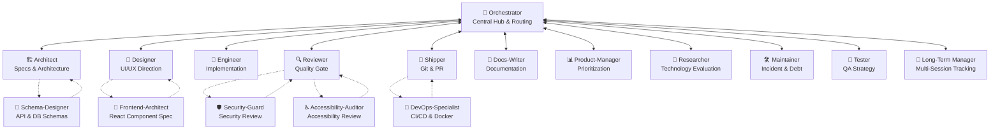

# The Workflow

## The canonical flow (Hub-and-Spoke)

All execution skills return control to the Orchestrator. The Orchestrator manages the task state and handles all routing:

## Mandatory routing rules

1. **Orchestrator always routes to Architect first.** Never directly to Designer or Engineer.
2. **Architect creates a spec** in `specs/changes/NNN-name/` for every change, including 1-line bug fixes.
3. **Designer acts before Engineer** whenever the change involves a visual interface.
4. **Engineer never does git operations** and never reviews its own code.
5. **Reviewer never writes code** and never runs git operations.
6. **Shipper is the only skill** that commits, creates branches, pushes, and opens PRs.
7. **Navigation menus are simplified** to return control to the Orchestrator (`[O] Return to Orchestrator`). Skills prioritize calling the `ask_question` tool for menus, falling back to markdown if unsupported.
8. **Sub-skills and supporting helpers assist core skills** — `project-brainstorm` and `long-term-manager` help `orchestrator`; `schema-designer` helps `architect`; `frontend-architect` helps `designer`; and `devops-specialist` helps `shipper`.
9. **All roads return to Orchestrator.** Every agent hands control back to Orchestrator between phases.
10. **Bundle Lock-In:** You are strictly forbidden from loading, referencing, or switching to any skills outside the 18 skills defined in this bundle.

## How supporting skills plug in

| Supporting skill | Typically invoked by | Returns to |
|-----------------|---------------------|------------|
| Product-Manager | Orchestrator | Orchestrator |
| Long-Term Manager | Orchestrator | Orchestrator |
| Researcher | Orchestrator | Orchestrator |
| Maintainer | Orchestrator | Orchestrator |
| Docs-Writer | Orchestrator or Architect | Orchestrator |
| Tester | Engineer | Orchestrator |
| Security-Guard | Reviewer | Orchestrator |
| Accessibility-Auditor | Reviewer | Orchestrator |
| Frontend-Architect | Designer | Orchestrator |
| Schema-Designer | Architect | Orchestrator |
| DevOps-Specialist | Shipper | Orchestrator |

## Which skill should I use?

| Task type | Routing Phase | Notes |
|-----------|----------|-------|
| New feature | Orchestrator ⇄ Architect | Always |
| UI redesign | Orchestrator ⇄ Designer ⇄ Orchestrator ⇄ Engineer | Designer before Engineer |
| Bug fix | Orchestrator ⇄ Architect | Lightweight spec |
| Refactor | Orchestrator ⇄ Architect | Impact analysis needed |
| Technology choice | Orchestrator ⇄ Researcher | Then ⇄ Architect for ADR |
| Multi-session project | Orchestrator ⇄ Long-Term Manager | Then ⇄ Architect for spec |
| Documentation only | Orchestrator ⇄ Docs-Writer | Via Architect for spec |
| Dependency update | Orchestrator ⇄ Maintainer | Then ⇄ Architect |
| Security audit | Orchestrator ⇄ Reviewer | Invokes Security-Guard |
| Test coverage | Orchestrator ⇄ Tester | Invoked via Orchestrator |
