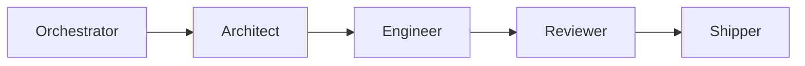

# Contributing

CrewLoop is documentation-first. Its value is in the precision of its instructions, so contributions should follow the same workflow the skills preach.

## How to add a new skill

1. Copy the template:

```bash
cp assets/templates/skill-template.md skills/<skill-name>/SKILL.md
```

2. Fill in the frontmatter and body following `references/skill-anatomy.md`.

3. Run the validator:

```bash
python scripts/validate-skills.py
```

4. Follow the full team workflow:



## How to improve documentation

1. Identify the gap.
2. Create or update a spec in `specs/changes/NNN-name/`.
3. Update the relevant `docs/docs/` files.
4. Run `cd docs && npm run build` to ensure the site builds.
5. Run `python scripts/validate-skills.py`.
6. Go through Reviewer and Shipper.

## Conventions

- Keep `SKILL.md` files concise.
- Put shared conventions in `references/`.
- Use the Conventional Commits standard.
- Never commit secrets, `.env` files, or build directories.

## Code of conduct

- Be precise.
- Be kind.
- Respect the separation of responsibilities between skills.
