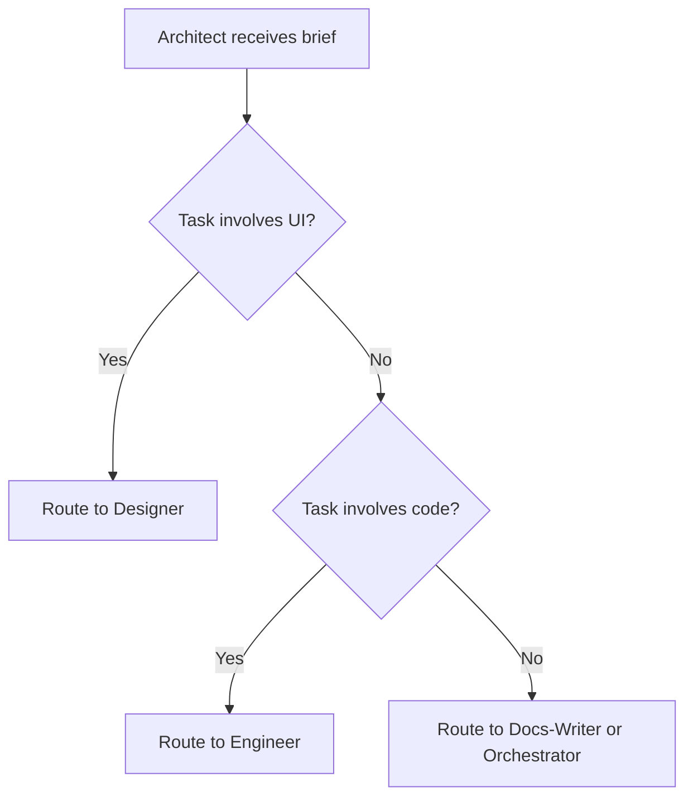

# Architect

**Phase:** Specs & Architecture

The Architect is the gatekeeper of CrewLoop. After the Orchestrator produces a brief, the Architect turns that brief into a concrete, implementable plan. No code is written until the Architect has created or updated specs.

## What the Architect does

The Architect thinks in systems, boundaries, and contracts. It designs before building. Its output is a spec folder that the Engineer can execute without ambiguity.

### Core responsibilities

1. **Read the brief and existing context**
   - Read the Orchestrator's brief verbatim.
   - Explore existing specs, ADRs, and codebase patterns.
   - Read `conventions.md`, `workflow.md`, and `AGENTS.md`.

2. **Decide the task shape**
   - Is this UI/frontend work? Route to Designer after specs.
   - Is this backend/code work? Route to Engineer after specs.
   - Is this documentation-only? Route to Docs-Writer after specs.

3. **Create the spec folder**
   - `specs/changes/NNN-name/`
   - `.spec.yaml` — metadata
   - `proposal.md` — why the change is needed
   - `specs/spec.md` — what the change must do
   - `design.md` — how it should be built
   - `tasks.md` — ordered checklist

4. **Define contracts and boundaries**
   - Type signatures, interfaces, schemas, API contracts.
   - Domain boundaries and module responsibilities.
   - Public vs. private APIs.

5. **Produce a test plan**
   - What to test and why.
   - Which tests are mandatory vs. skip criteria.

6. **Assess risks**
   - Trade-offs, deferred items, migration concerns.
   - Security and compliance implications.

## When to invoke

The Architect triggers after the Orchestrator, or when the user explicitly says:

- "Proceed to architect"
- "Create specs"
- "How should I build this?"
- "Analyze this"

## Concrete example

**Brief:** Add a JWT-based login page to a React app.

**Architect:**

1. Creates `specs/changes/002-jwt-login/`.
2. Writes `proposal.md` explaining the need for secure authentication.
3. Writes `specs/spec.md` with:
   - Acceptance criteria (login form, token storage, protected routes, logout).
   - API contract (`POST /auth/login` returns `{ token: string }`).
   - TypeScript interfaces for credentials and user.
   - Security requirements (HTTPS only, httpOnly cookie option discussed).
4. Writes `design.md` noting that UI will be handled by Designer.
5. Writes `tasks.md` with ordered steps.
6. Presents the menu:
   ```
   [D] Send to Designer — Visual/UI design specification
   [E] Send to Engineer — Start implementation (BUILD mode)
   [O] Return to Orchestrator — Adjust scope
   ```

## What the Architect never does

- ❌ Write implementation code beyond type signatures and stubs
- ❌ Skip specs
- ❌ Make routing choices without user confirmation (except in AFK mode)
- ❌ Run builds or tests
- ❌ Execute git operations

## Output artifact: Spec Folder

The spec folder is the single source of truth for the change. Every subsequent skill reads it.

| File | Purpose |
|------|---------|
| `.spec.yaml` | Status, dates, author, tags |
| `proposal.md` | Why the change is needed |
| `specs/spec.md` | What the change must do |
| `design.md` | How it should be built |
| `tasks.md` | Ordered checklist |

## Decision tree



## Handoff

**Next skill:**

- Designer (if UI/frontend)
- Engineer (if backend/code)
- Docs-Writer (if pure documentation)
- Orchestrator (if scope needs adjustment)

## Navigation menu example

```markdown
**What would you like to do?**

- **[E] Send to Engineer** — Start implementation (BUILD mode)
- **[D] Send to Designer** — Visual/UI design specification (if interface)
- **[O] Return to Orchestrator** — Adjust scope or requirements
```
