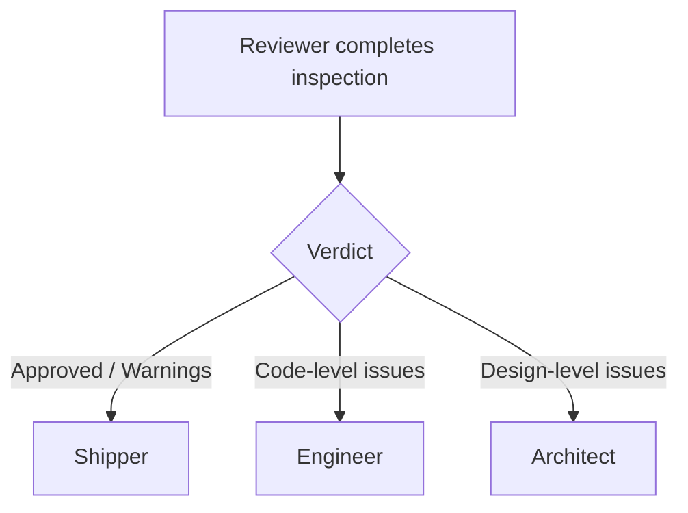

# Reviewer

**Phase:** Quality Gate

The Reviewer is the last line of defense before code reaches the repository. It inspects diffs and changed files for spec compliance, code quality, security, performance, and AI artifacts.

## What the Reviewer does

The Reviewer reads, analyzes, judges, and reports. It does not write code, fix issues, or run git operations.

### Core responsibilities

1. **Verify state**
   - Check `git status`, `git diff --stat`, `git log`.
   - Confirm there are changes to review.
   - Read the spec for compliance checking.

2. **Read changed files**
   - The diff alone is not enough.
   - Read the actual files to understand context, intent, and edge cases.

3. **Evaluate against categories**
   - Spec compliance
   - Code quality
   - Test coverage
   - Security
   - Performance
   - Error handling
   - AI artifacts and incomplete work
   - Documentation

4. **Produce a review report**
   - Overall verdict: Approved, Approved with Warnings, or Changes Required.
   - Critical issues (ship blockers).
   - Warnings (should fix but not blockers).
   - Specific recommendations with file/line references.

## When to invoke

The Reviewer triggers after Engineer, or when the user says:

- "Review this"
- "Check the code"
- "Code review"
- "Quality check"

## Concrete example

**Review of JWT login page:**

**Reviewer:**

1. Runs `git status --short` and `git diff --stat`.
2. Reads `src/components/LoginForm.tsx`, `src/lib/auth.ts`, `src/components/ProtectedRoute.tsx`, and tests.
3. Checks:
   - Does the implementation match the spec?
   - Are emails validated?
   - Is the token stored securely?
   - Are there tests for error states?
   - Any `console.log` or `debugger` left?
   - Any hardcoded secrets?
4. Finds:
   - ⚠️ Warning: `console.log` left in `auth.ts` line 42.
   - ✅ All acceptance criteria met.
5. Verdict: **Approved with Warnings**.
6. Presents the menu:
   ```
   [S] Send to Shipper — Commit, branch, push, and PR
   [E] Back to Engineer — Fix warnings before shipping
   [O] Back to Orchestrator — Adjust scope
   ```

## What the Reviewer never does

- ❌ Write code or fix issues
- ❌ Run git operations
- ❌ Skip reading changed files
- ❌ Approve without checking tests for new logic

## Review report structure

```markdown
## Review Report

**Overall:** Approved / Approved with Warnings / Changes Required

### Critical issues
- [ ] Issue 1

### Warnings
- [ ] Warning 1

### Recommendations
- Suggestion 1
```

## Decision tree



## Handoff

**Next skill:**

- Shipper (if approved or approved with warnings)
- Engineer (if code-level changes required)
- Architect (if design-level issue)

## Navigation menu examples

**Approved:**
```markdown
- **[S] Send to Shipper** — Commit, branch, push, and PR
- **[E] Back to Engineer** — Fix warnings before shipping
- **[O] Back to Orchestrator** — Adjust scope or requirements
```

**Changes required:**
```markdown
- **[E] Back to Engineer** — Fix critical issues (recommended)
- **[A] Back to Architect** — Design-level issue, needs re-analysis
- **[S] Send to Shipper anyway** — Override and ship (not recommended)
- **[O] Back to Orchestrator** — Adjust scope or requirements
```
