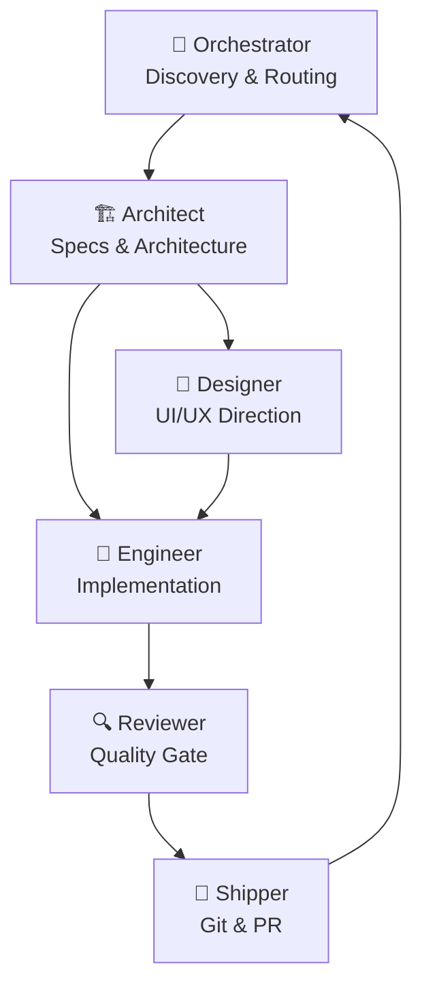

# What is CrewLoop?

CrewLoop is a team of AI skills that work together as a complete, role-separated software development workflow — from requirements discovery to git push — ensuring no step is skipped and every change is traceable.

Instead of asking a single AI to "build this feature", CrewLoop distributes responsibilities across 18 specialized skills. Each skill owns one phase and never invades another's territory.

## The crew at a glance

### Core Skills — mandatory in every task

| Skill | Phase | What it does |
|-------|-------|--------------|
| **Orchestrator** | Discovery | Gathers context, asks the right questions, routes the task |
| **Architect** | Specs | Creates mandatory specs and architectural contracts |
| **Designer** | Design | Defines aesthetic direction for every UI change |
| **Engineer** | Build | Writes implementation code and tests — the only one who does |
| **Reviewer** | Review | Audits quality, security, and spec compliance |
| **Shipper** | Ship | The only skill allowed to touch git |

### Supporting Skills — invoked as needed

| Skill | Invoked when |
|-------|-------------|
| **Docs-Writer** | Pure documentation tasks |
| **Long-Term Manager** | Projects that span multiple sessions and need durable tracking artifacts |
| **Tester** | Test strategy, QA, coverage analysis |
| **Product-Manager** | Prioritization, roadmap, user stories |
| **Maintainer** | Bug triage, technical debt, dependency updates |
| **Researcher** | Technology evaluation, library comparison |
| **Security-Guard** | Security review, secret scanning, auth |
| **Accessibility-Auditor** | WCAG compliance, keyboard nav, screen readers |

## The flow

## What CrewLoop is not

- **Not a single AI assistant.** It is a structured workflow enforced through skill files.
- **Not a build tool.** It does not compile, bundle, or deploy your application.
- **Not opinionated about your stack.** Use any language, framework, or platform — the crew adapts.

## Next steps

→ [Why CrewLoop?](./why-crewloop) — the problem it solves  
→ [Installation](./installation) — get the skills into your agent in 60 seconds
