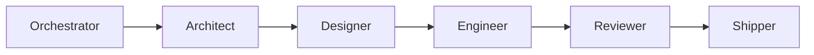
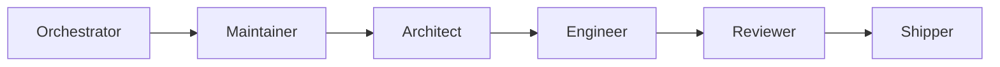
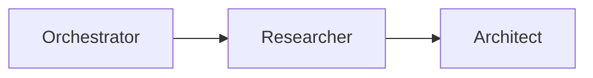

# Usage Examples

These examples show how complete tasks flow through CrewLoop end to end.

## Example 1: Add a JWT login page

**User request:** "Add a JWT login page to my React app."

### Flow

### Phase by phase

1. **Orchestrator** asks:
   - Authentication backend?
   - Visual style?
   - Existing design system?
   - Need password recovery or social login?

2. **Architect** creates `specs/changes/003-jwt-login/` with:
   - API contract: `POST /auth/login` → `{ token: string }`
   - Acceptance criteria
   - TypeScript interfaces
   - Test plan

3. **Designer** produces a design spec:
   - Direction: luxury/refined
   - Color palette, typography, wireframes
   - Focus states and reduced-motion support

4. **Engineer** implements:
   - `LoginForm.tsx`
   - `auth.ts` service
   - `ProtectedRoute.tsx`
   - Tests for all three

5. **Reviewer** inspects and approves with a warning about a leftover `console.log`.

6. **Shipper** creates branch `feat/jwt-login-page`, archives the spec, commits, and pushes.

### Result

A complete, reviewed, and traceable login feature.

---

## Example 2: Fix a flaky test

**User request:** "Our checkout tests are flaky."

### Flow

### Phase by phase

1. **Orchestrator** routes to Maintainer because this is upkeep/diagnosis.

2. **Maintainer** diagnoses:
   - Recent dependency update changed async behavior.
   - Tests have race conditions in setup.

3. **Maintainer** routes to Architect to create a spec for the fix.

4. **Architect** creates `specs/changes/004-fix-flaky-checkout-tests/`.

5. **Engineer** refactors test setup to use `waitFor` and stable selectors.

6. **Reviewer** confirms tests pass consistently and no logic was changed.

7. **Shipper** commits as `test(checkout): fix flaky tests`.

### Result

Stable test suite with documented root cause.

---

## Example 3: Choose a database

**User request:** "Should we use PostgreSQL or MongoDB for the new service?"

### Flow

### Phase by phase

1. **Orchestrator** routes to Researcher because this is technology evaluation.

2. **Researcher** compares:
   - PostgreSQL: ACID, relational, complex queries.
   - MongoDB: flexible schema, horizontal scaling.

3. **Researcher** recommends PostgreSQL based on transactional requirements and team familiarity.

4. **Researcher** routes to Architect to create an ADR.

5. **Architect** writes `specs/decisions/001-database-postgres.md`.

### Result

A documented decision with clear rationale.

---

## Example 4: Redesign a dashboard

**User request:** "Redesign the analytics dashboard."

### Flow

### Phase by phase

1. **Orchestrator** gathers context:
   - Current dashboard pain points.
   - Target users and devices.
   - Visual references.

2. **Architect** creates specs defining new widgets, data requirements, and API contracts.

3. **Designer** commits to a bold editorial direction with asymmetric layouts and strong typography.

4. **Engineer** implements the new components and data fetching.

5. **Reviewer** checks accessibility, responsive behavior, and spec compliance.

6. **Shipper** packages the redesign into a clean PR.

### Result

A distinctive, accessible, and well-documented dashboard redesign.
