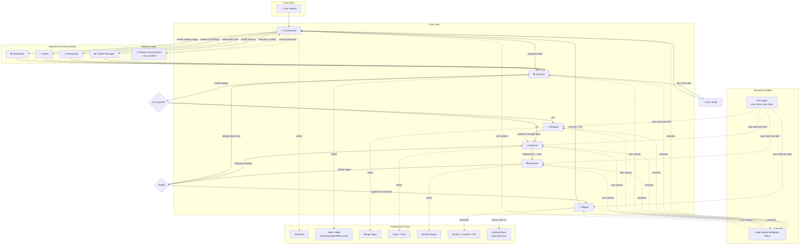

# Workflow

CrewLoop is not just a list of skills — it is a **state machine for software development**. Every task moves through well-defined phases, produces traceable artifacts, and only advances through explicit user confirmation or AFK-mode automation.

This page explains the complete end-to-end flow: user input, core loop, supporting skills, decision branches, rework loops, artifacts, memory, and spec archiving.

---

## End-to-end flow



---

## Phases explained

### 1. User entry

Every task starts with a user request: "add a feature", "fix this bug", "redesign this page", etc. The request can be vague or detailed.

### 2. Orchestrator — Discovery & Routing

The Orchestrator is the only skill that talks directly to the user at the start. It:

- Reads global conventions and references.
- Optionally reads the Obsidian vault for prior context.
- Asks 2–4 clarifying questions at a time.
- Produces a **Task Brief**.
- Routes to Architect (always) or to an optional advisor (Product Manager, Researcher, Tester, Maintainer).

**Output artifact:** `Task Brief`

### 3. Optional advisors

These skills are invoked by the Orchestrator when the task needs framing before architecture:

| Skill | When invoked |
|-------|-------------|
| Product Manager | Prioritization, user stories, success metrics |
| Researcher | Technology evaluation, framework comparison |
| Tester | QA strategy, coverage gaps, bug reproduction |
| Maintainer | Technical debt, incidents, dependency updates |

All advisors route back to **Architect**.

### 4. Architect — Specs & Architecture

The Architect is the gatekeeper. It:

- Reads the brief and existing specs.
- Creates a spec folder in `specs/changes/NNN-name/`.
- Writes `proposal.md`, `specs/spec.md`, `design.md`, `tasks.md`, and `.spec.yaml`.
- Decides the next step based on the task type.

**Decision branch:**

| Task type | Next skill |
|-----------|-----------|
| UI/frontend work | Designer |
| Backend/code work | Engineer |
| Pure documentation | Docs-Writer |

**Output artifact:** `Spec Folder`

### 5. Designer — UI/UX Direction

When the task involves a visual interface, the Designer produces a detailed design spec before any code is written.

**Output artifact:** `Design Spec`

### 6. Engineer — Build & Implementation

The Engineer implements the spec, writes tests, and verifies builds. It never redesigns architecture, changes contracts, runs git operations, or reviews its own code.

**Output artifact:** `Code + Tests`

### 7. Reviewer — Quality Gate

The Reviewer inspects the diff and changed files for:

- Spec compliance
- Code quality
- Test coverage
- Security issues
- Performance concerns
- Error handling
- AI artifacts

**Decision branch:**

| Verdict | Next skill |
|---------|-----------|
| Approved / approved with warnings | Shipper |
| Changes required (code-level) | Engineer |
| Design-level issue | Architect |

**Output artifact:** `Review Report`

### 8. Shipper — Git & PR

The Shipper handles the git workflow:

- Verifies git state.
- Archives the spec from `specs/changes/` to `specs/archive/YYYY-MM-DD-NNN-name/`.
- Creates a Conventional Commit message.
- Creates a branch.
- Commits and pushes.
- Prepares the PR link.

**Output artifacts:** `Branch + Commit + PR`, `Archived Spec`

### 9. Return to Orchestrator

After shipping, the flow returns to the Orchestrator. The user can start a new task or continue iterating.

---

## Interaction modes

### Letter-based navigation menu

At the end of each skill, a menu is presented with letter options such as:

```
[A] Architect  [D] Designer  [E] Engineer
[R] Reviewer   [S] Shipper   [O] Orchestrator
```

Each skill includes only the options relevant for its next handoff. The agent waits for explicit user confirmation before loading the next skill.

### AFK mode

When the user activates AFK mode (or `MEMORY.md` contains `afk: true`), the skill:

- Skips the navigation menu.
- States the next skill being activated.
- Loads the next skill automatically via the `Skill` tool.

AFK mode is the only exception to the "never route automatically" rule.

---

## Memory layer

The **Obsidian Second Brain** skill provides optional memory and RAG:

- Reads `AGENT.md` and `MEMORY.md` at the start of vault work.
- Searches prior notes in `Knowledge/` and `Journal/`.
- Persists decisions, patterns, and session outcomes.

If the vault or MCP server is unavailable, the skill gracefully skips vault operations and continues using in-session context.

---

## Spec lifecycle

```
specs/
├── changes/        # Active deltas
│   └── NNN-name/
│       ├── .spec.yaml
│       ├── proposal.md
│       ├── specs/
│       ├── design.md
│       └── tasks.md
├── archive/        # Completed changes
│   └── YYYY-MM-DD-NNN-name/
├── living/         # Merged source of truth
└── decisions/      # ADRs
```

1. Architect creates a spec in `specs/changes/`.
2. Engineer uses the spec as the source of truth.
3. Reviewer verifies compliance against the spec.
4. Shipper moves the spec to `specs/archive/` on commit.

---

## Rules summary

1. **Orchestrator always sends to Architect first.** Never directly to Designer, Engineer, or Docs-Writer.
2. **Architect creates specs for every change.** No exceptions, including one-line bug fixes.
3. **Designer acts before Engineer** when there is a UI.
4. **Engineer never does git or review.** Those belong to Reviewer and Shipper.
5. **Reviewer never writes code or runs git.** It only judges what is built.
6. **Shipper is the only skill that touches git.** Commit, branch, push, PR.
7. **All skills return to Orchestrator.** It is the central hub.
8. **Specs are archived on ship.** `specs/changes/` becomes `specs/archive/`.
