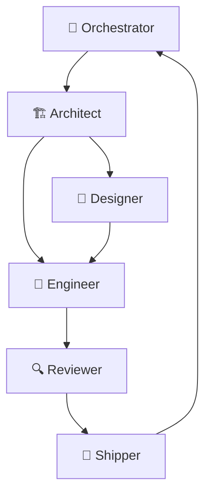

# Workflow

CrewLoop enforces a mandatory flow so that every change is discovered, specified, designed (when UI is involved), implemented, reviewed, and shipped.

## Core flow



## Flow rules

1. **Orchestrator always sends to Architect first** — never directly to Designer or Engineer.
2. **Architect is the gatekeeper** — creates specs and decides the next step.
3. **Designer acts before Engineer** — when there is UI, design specs come first.
4. **Engineer never does git or review** — those are separate roles.
5. **Reviewer is the quality gate** — no code ships without review.
6. **Shipper is the only one who touches git** — commit, branch, push, PR.
7. **Specs are archived on commit** — `specs/changes/` becomes `specs/archive/`.

## Optional advisors

The orchestrator may also route to supporting skills before or alongside the core flow:

- **Product-Manager** — framing and prioritization
- **Researcher** — technology evaluation
- **Tester** — QA strategy and coverage
- **Maintainer** — incidents, debt, and upkeep
- **Docs-Writer** — standalone documentation tasks
- **Obsidian Second Brain** — memory and RAG

## Adding a new skill

1. Copy the template:

```bash
cp assets/templates/skill-template.md skills/<skill-name>/SKILL.md
```

2. Fill in the frontmatter and body following `references/skill-anatomy.md`.

3. Run the validator:

```bash
python scripts/validate-skills.py
```

4. Follow the full team workflow to integrate it.
