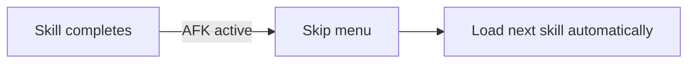

# AFK Mode

AFK mode allows the CrewLoop flow to continue without manual menu selection at every handoff. It is useful when the user trusts the routing and wants the crew to keep moving.

## How to activate

AFK mode is activated when the user explicitly says "AFK", "estarei AFK", "modo AFK", or similar.

## Behavior

When AFK mode is active, a skill:

1. Skips the navigation menu at the end.
2. States the next skill being activated.
3. Loads the next skill automatically via the `Skill` tool.

## Example

**User:** "Build a login page. I'll be AFK."

**CrewLoop:**

1. Orchestrator gathers context and routes to Architect.
2. Architect creates specs and routes to Designer.
3. Designer creates design spec and routes to Engineer.
4. Engineer implements and routes to Reviewer.
5. Reviewer approves and routes to Shipper.
6. Shipper commits and routes back to Orchestrator.

At each step, the next skill is loaded automatically without asking the user.

## When to use

AFK mode is useful for:

- Well-understood tasks with clear specs.
- Long-running flows where manual confirmation would be tedious.
- Trusted environments where the user wants minimal interruption.

## When not to use

Avoid AFK mode when:

- The task is ambiguous or high-risk.
- You want to review each handoff.
- The change touches critical infrastructure or security.

## Fallback to manual mode

At any time, the user can say "stop AFK" or "I want to choose" to return to manual navigation menus.
