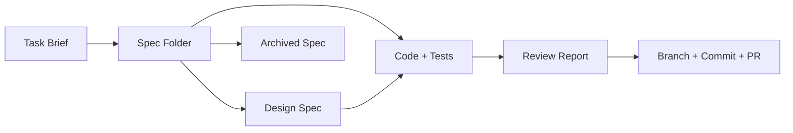

# Artifacts

Artifacts are the documents and code produced at each phase of the CrewLoop flow. They make the workflow traceable and auditable.

## Artifact lifecycle

## Task Brief

**Produced by:** Orchestrator

The brief captures what the user wants, why, and under what constraints. It is the input to the Architect.

| Section | Example |
|---------|---------|
| Type | New feature |
| Domain | Frontend |
| Objective | Add JWT-based login |
| Requirements | Email/password form, token storage, protected routes |
| Constraints | React + TypeScript, existing Tailwind setup |

## Spec Folder

**Produced by:** Architect

The spec folder is the single source of truth for a change.

| File | Purpose |
|------|---------|
| `.spec.yaml` | Metadata |
| `proposal.md` | Why the change is needed |
| `specs/spec.md` | What the change must do |
| `design.md` | How it should be built |
| `tasks.md` | Ordered checklist |

## Design Spec

**Produced by:** Designer

Defines visual and interaction direction for UI work.

| Section | Example |
|---------|---------|
| Direction | Luxury/refined |
| Color palette | `#0f172a`, `#6366f1` |
| Typography | Inter + Canela |
| Wireframes | ASCII or reference images |

## Code + Tests

**Produced by:** Engineer

The actual implementation and its tests.

| Type | Example |
|------|---------|
| Components | `LoginForm.tsx` |
| Services | `auth.ts` |
| Tests | `LoginForm.test.tsx` |

## Review Report

**Produced by:** Reviewer

Documents findings and the overall verdict.

| Section | Example |
|---------|---------|
| Verdict | Approved with Warnings |
| Critical issues | None |
| Warnings | `console.log` in `auth.ts:42` |
| Recommendations | Remove log, add loading state test |

## Branch + Commit + PR

**Produced by:** Shipper

The git artifacts that package the change.

| Artifact | Example |
|----------|---------|
| Branch | `feat/jwt-login-page` |
| Commit | `feat(auth): add JWT login page` |
| PR | `https://github.com/leorsousa05/CrewLoop/compare/feat/jwt-login-page` |

## Archived Spec

**Produced by:** Shipper

After commit, the spec is moved from `specs/changes/NNN-name/` to `specs/archive/YYYY-MM-DD-NNN-name/`.

This preserves the history of why and how the change was made.
