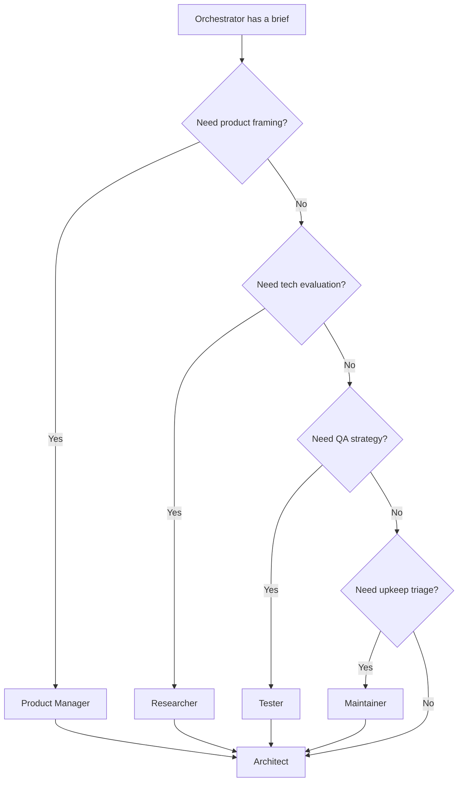
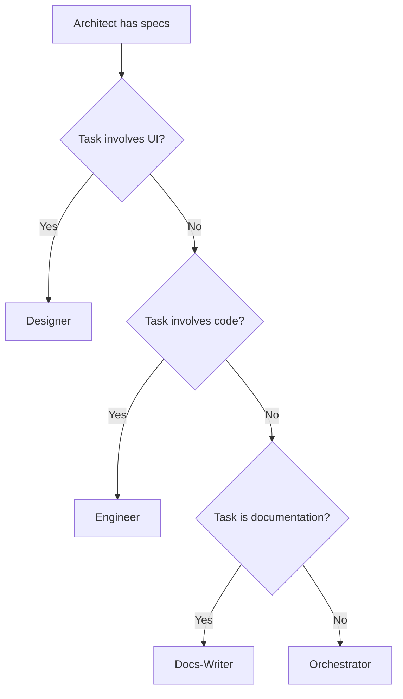
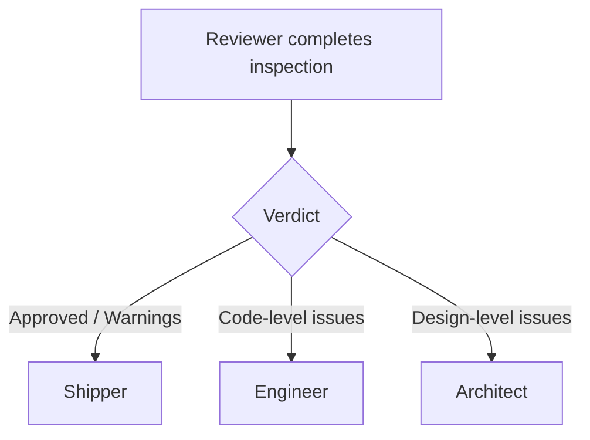
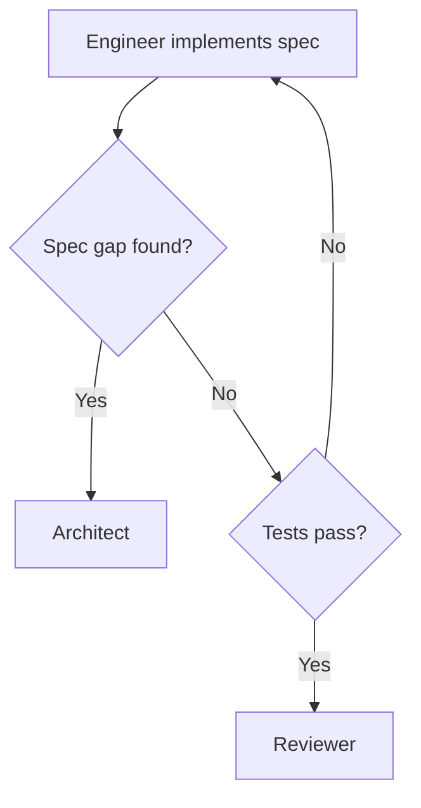

# Decision Trees

CrewLoop is full of explicit decision points. This page documents the most important ones so you always know what comes next.

## Orchestrator: where to route?

## Architect: Designer, Engineer, or Docs-Writer?

## Reviewer: Ship, Fix, or Re-analyze?

## Engineer: continue, redesign, or escalate?

## Common routing patterns

| Scenario | Route |
|----------|-------|
| "Add a login page" | Orchestrator → Architect → Designer → Engineer → Reviewer → Shipper |
| "Fix API response bug" | Orchestrator → Architect → Engineer → Reviewer → Shipper |
| "Should we use Postgres or Mongo?" | Orchestrator → Researcher → Architect |
| "Document the auth module" | Orchestrator → Architect → Docs-Writer → Shipper |
| "Tests are flaky" | Orchestrator → Maintainer → Engineer → Reviewer → Shipper |
