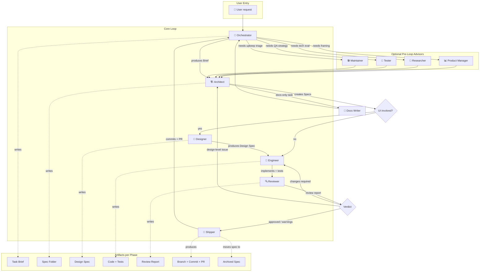

# Detailed Flow

This page walks through the entire CrewLoop flow phase by phase, including user entry points, supporting skills, rework loops, and handoffs.

## Complete end-to-end diagram

## Phase 1: User entry

Every task starts with a user request. It can be vague or detailed:

- "Add a login page"
- "Fix this bug where users can't reset passwords"
- "Refactor the auth module to use JWT"
- "What technology should we use for real-time updates?"

## Phase 2: Orchestrator — Discovery & Routing

The Orchestrator:

1. Reads global conventions and references.
2. Asks 2–4 clarifying questions.
4. Produces a **Task Brief**.
5. Routes to Architect (always) or to an optional advisor.

## Phase 3: Optional advisors

These skills are invoked when the task needs framing before architecture:

| Skill | When invoked | Output |
|-------|-------------|--------|
| Product Manager | Prioritization, user stories, metrics | Product Brief |
| Researcher | Technology evaluation | Research Report |
| Tester | QA strategy, bug reproduction | Test Plan |
| Maintainer | Technical debt, incidents | Maintenance Plan |

All advisors route back to **Architect**.

## Phase 4: Architect — Specs & Architecture

The Architect:

1. Reads the brief and existing context.
2. Creates a spec folder in `specs/changes/NNN-name/`.
3. Decides the next step based on task type.

**Decision branch:**

| Task type | Next skill |
|-----------|-----------|
| UI/frontend work | Designer |
| Backend/code work | Engineer |
| Pure documentation | Docs-Writer |

## Phase 5: Designer — UI/UX Direction

When UI is involved, the Designer produces a detailed design spec before any code is written. This prevents generic UI and ensures accessibility.

## Phase 6: Engineer — Build & Implementation

The Engineer:

1. Reads specs and design spec.
2. Implements code.
3. Writes tests.
4. Verifies builds.

## Phase 7: Reviewer — Quality Gate

The Reviewer inspects the diff and changed files, then produces a verdict:

| Verdict | Next skill |
|---------|-----------|
| Approved / approved with warnings | Shipper |
| Changes required (code-level) | Engineer |
| Design-level issue | Architect |

## Phase 8: Shipper — Git & PR

The Shipper:

1. Verifies git state.
2. Archives the spec.
3. Creates a Conventional Commit.
4. Creates a branch, commits, and pushes.
5. Prepares the PR link.

After shipping, the flow returns to the Orchestrator.

## Rework loops

CrewLoop expects rework. The Reviewer can send work back:

- **Reviewer → Engineer** for code-level fixes.
- **Reviewer → Architect** for design-level issues.
- **Engineer → Architect** if a spec gap is discovered during implementation.

These loops are a feature, not a bug. They prevent low-quality code from reaching the repository.
