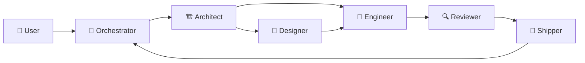
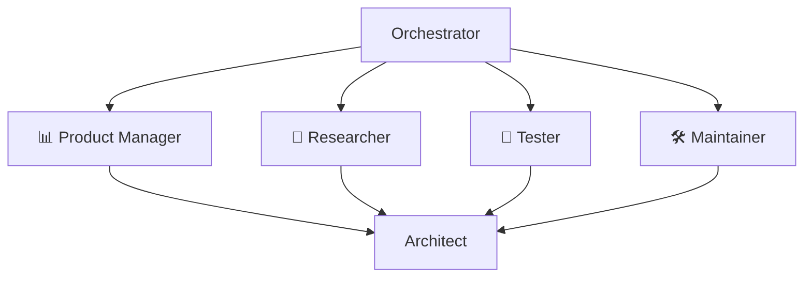

# Workflow Overview

CrewLoop is a **state machine for software development**. Every task moves through well-defined phases, produces traceable artifacts, and only advances through explicit user confirmation or AFK-mode automation.

## The big picture

## The mandatory core flow

| Step | Skill | Purpose |
|------|-------|---------|
| 1 | **Orchestrator** | Discover requirements and route to Architect |
| 2 | **Architect** | Create specs and decide next phase |
| 3 | **Designer** | Define UI/UX direction (only if UI is involved) |
| 4 | **Engineer** | Implement code and tests |
| 5 | **Reviewer** | Audit quality and compliance |
| 6 | **Shipper** | Commit, push, and prepare PR |

After shipping, the flow returns to the Orchestrator.

## Optional advisors

Before or alongside the core flow, the Orchestrator can invoke supporting skills:

These advisors always route back to the Architect.

## Why the flow is mandatory

Skipping steps is how software projects accumulate debt. CrewLoop enforces:

- **Specs before code** — every change is documented.
- **Design before implementation** — UI is intentional, not accidental.
- **Review before shipping** — quality is verified, not assumed.
- **Traceability** — every change leaves artifacts.

## Next steps

- Read the [Detailed Flow](detailed-flow) for a phase-by-phase breakdown.
- See [Decision Trees](decision-trees) for routing logic.
- Learn about [Artifacts](artifacts) produced at each phase.
- Understand [AFK Mode](afk-mode) for hands-off routing.
