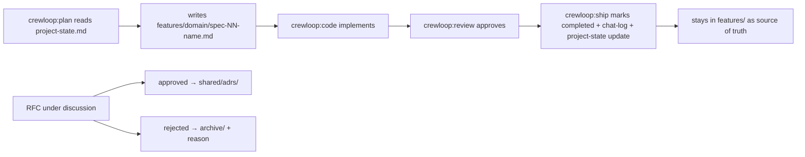

# Specs

A **spec** is the source of truth for a task. Every task, including 1-line bug fixes, gets a single-file feature spec before any code is written. No exceptions.

## Why specs exist

Without a spec, `crewloop:code` does not know what to build, `crewloop:review` cannot verify compliance, and the team cannot trace why a decision was made six months later. Specs make the workflow auditable and the implementation unambiguous — and because completed specs stay in place as the source of truth, the next session starts from real context instead of re-discovering everything.

## Spec folder structure

```
specs/
├── features/                    # The real work — one spec = one task
│   ├── 00-core/
│   │   └── spec-01-project-setup.md
│   ├── 01-cli/
│   ├── 02-dashboard/
│   ├── 03-docs/
│   └── 04-workflow/
├── changes/                     # RFCs only — proposals under discussion
│   └── rfc-NNN-name.md
├── memory/                      # Project brain
│   ├── project-state.md         # Always read: modules, decisions, blockers, next task
│   ├── chat-logs/               # Session summaries
│   ├── decisions/               # Lightweight rationale notes
│   └── incidents/               # Post-mortems
├── shared/                      # Stable references (never copied, linked)
│   ├── glossary.md
│   ├── tech-stack.md
│   ├── conventions.md
│   ├── architecture-overview.md
│   └── adrs/                    # Architectural Decision Records
├── templates/                   # feature-spec, rfc, adr, task-prompt blueprints
└── archive/                     # Dead/rejected specs, indexed in README.md
```

## When to create a spec

| Change size | Required file |
|-------------|---------------|
| Bug fix / tweak | Single feature spec (minimal: Objective, Edge Cases, Acceptance Criteria, Done When) |
| Feature / component | Full feature spec (all sections) |
| Architecture / cross-cutting | RFC in `changes/` first → approved RFC becomes an ADR |

**Feature specs live in `specs/features/<domain>/spec-NN-name.md`. RFCs live in `specs/changes/rfc-NNN-name.md`. Never place spec files directly in `specs/`.**

## What a feature spec contains

```markdown
---
name: spec-NN-name
domain: NN-domain
status: active
created: YYYY-MM-DD
completed: null
supersedes: []
---

## Objective          # What this task achieves (falsifiable)
## Context            # Links to shared/, never copies
## Requirements       # Numbered, testable
## Behavior / Flow    # Happy path, step by step
## Constraints        # What must NOT be done
## Edge Cases         # Invalid inputs, error paths, boundaries
## Acceptance Criteria  # Given/When/Then, AC-01…
## Done When          # Each item references an AC ID + the test that proves it
```

## Spec lifecycle



## Project memory

`specs/memory/project-state.md` is read at the start of every session and updated at session end. It records module status, recent decisions, blockers, and the suggested next task — the single file that prevents the agent from losing the plot between sessions.
