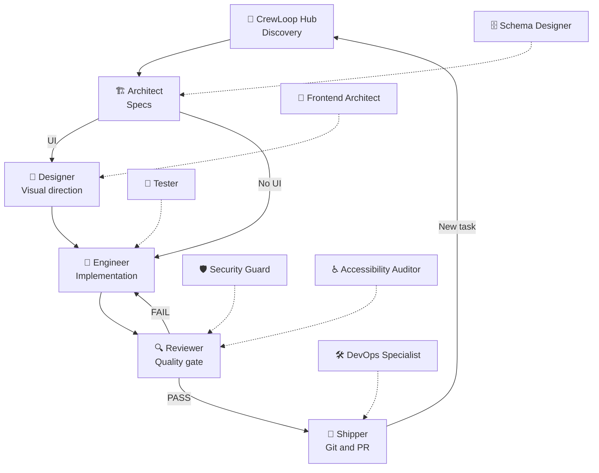

# The Workflow

## The canonical flow

CrewLoop uses direct routing during interactive work. Each phase owns its ending and hands off to the next selected skill. CrewLoop Hub mediates only task entry and every transition in AFK mode.



## Mandatory routing rules

1. **Architect is the first mandatory delivery phase.** Hub may use approved discovery/tracking helpers first, but never routes directly to Designer or Engineer.
2. **Architect creates a spec** in `specs/changes/NNN-name/` for every change, including one-line fixes.
3. **Designer acts before Engineer** whenever a change affects a visual interface.
4. **Engineer implements and tests**, but never performs Git operations or reviews its own work.
5. **Reviewer is the quality gate**, but never writes implementation code or performs Git operations.
6. **Shipper is the only Git operator** for branches, commits, pushes, tags, and pull requests.
7. **Interactive skills route directly.** Their ending menu loads the selected skill without requiring a typed command.
8. **Supporting skills return to their actual invoker.** The default invoker applies when no explicit parent is available; Maintainer and Project Brainstorm instead route confirmed triage/completed briefs to Architect.
9. **AFK is the exception.** Every non-Hub skill returns to CrewLoop Hub; the Hub selects the next phase from workflow state.
10. **Bundle Lock-In:** routing and role execution stay within the 19 CrewLoop skills.

## How supporting skills plug in

| Supporting skill | Default invoker | Interactive return |
|------------------|-----------------|--------------------|
| Project Brainstorm | CrewLoop Hub | Architect after the brief, or Hub for a new task |
| Long-Term Manager | CrewLoop Hub | Actual invoker |
| DiamondBlock | CrewLoop Hub | Actual invoker |
| Product Manager | CrewLoop Hub | Actual invoker |
| Researcher | CrewLoop Hub | Actual invoker |
| Docs Writer | CrewLoop Hub | Actual invoker |
| Maintainer | CrewLoop Hub | Architect for a confirmed bug |
| Tester | Engineer | Actual invoker |
| Security Guard | Reviewer | Actual invoker |
| Accessibility Auditor | Reviewer | Actual invoker |
| Frontend Architect | Designer | Actual invoker |
| Schema Designer | Architect | Actual invoker |
| DevOps Specialist | Shipper | Actual invoker |

In AFK mode, every row above returns to CrewLoop Hub instead of routing directly.

## Which skill should I use?

| Task type | Typical path |
|-----------|--------------|
| New feature | Hub → Architect → Engineer → Reviewer → Shipper |
| UI redesign | Hub → Architect → Designer → Engineer → Reviewer → Shipper |
| Bug fix | Hub → Maintainer → Architect → Engineer → Reviewer → Shipper |
| Technology choice | Hub → Researcher → Hub → Architect |
| Multi-session project | Hub → Long-Term Manager → Hub → Architect |
| Documentation only | Hub → Architect → Engineer → Docs Writer → Engineer → Reviewer → Shipper |
| Security audit | Reviewer → Security Guard → Reviewer |
| Test strategy | Engineer → Tester → Engineer |

## AFK mode

AFK mode removes navigation menus while preserving every mandatory gate:

```text
Current skill completes → CrewLoop Hub evaluates state → next skill
```

The Hub still requires Architect before any delivery phase, and Reviewer FAIL still loops to the appropriate authoring/implementation skill.
