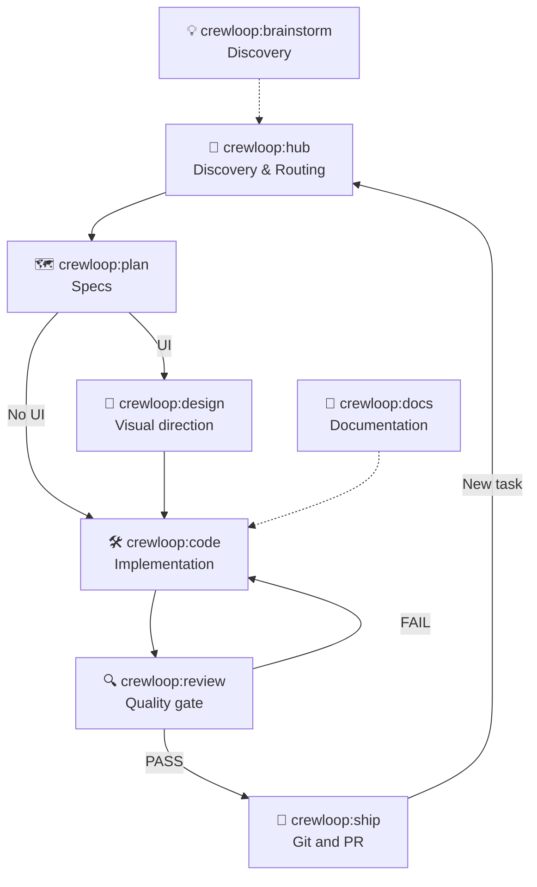

# The Workflow

## The canonical flow

CrewLoop uses direct routing during interactive work. Each phase owns its ending and hands off to the next selected skill. `crewloop:hub` mediates only task entry and every transition in AFK mode.


```mermaid
flowchart TD
    H["🎯 crewloop:hub<br/>Discovery & Routing"] --> P["🗺️ crewloop:plan<br/>Specs"]
    P -->|UI| D["🎨 crewloop:design<br/>Visual direction"]
    P -->|No UI| C["🛠️ crewloop:code<br/>Implementation"]
    D --> C
    C --> R["🔍 crewloop:review<br/>Quality gate"]
    R -->|PASS| S["🚀 crewloop:ship<br/>Git and PR"]
    R -->|FAIL| C
    S -->|New task| H

    B["💡 crewloop:brainstorm<br/>Discovery"] -.-> H
    DOC["📝 crewloop:docs<br/>Documentation"] -.-> C
```

## Mandatory routing rules

1. **`crewloop:plan` is the first mandatory delivery phase.** `crewloop:hub` may use `crewloop:brainstorm` for discovery, but never routes directly to `crewloop:design` or `crewloop:code`.
2. **`crewloop:plan` creates a feature spec** in `specs/features/<domain>/spec-NN-name.md` for every change, including one-line fixes.
3. **`crewloop:design` acts before `crewloop:code`** whenever a change affects a visual interface.
4. **`crewloop:code` implements and tests**, but never performs Git operations or reviews its own work.
5. **`crewloop:review` is the quality gate**, but never writes implementation code or performs Git operations.
6. **`crewloop:ship` is the only Git operator** for branches, commits, pushes, tags, and pull requests.
7. **Interactive skills route directly.** Their ending menu loads the selected skill without requiring a typed command.
8. **Supporting skills return to their actual invoker.** `crewloop:brainstorm` hands a completed brief to `crewloop:plan`; `crewloop:docs` returns to the skill that invoked it.
9. **AFK is the exception.** Every non-Hub skill returns to `crewloop:hub`; the Hub selects the next phase from workflow state.
10. **Bundle Lock-In:** routing and role execution stay within the 8 CrewLoop skills.

## How supporting skills plug in

| Supporting skill | Default invoker | Interactive return |
|------------------|-----------------|--------------------|
| `crewloop:brainstorm` | `crewloop:hub` | `crewloop:plan` with a completed brief |
| `crewloop:docs` | `crewloop:hub` (or any core skill) | Actual invoker |

In AFK mode, every row above returns to `crewloop:hub` instead of routing directly.

## Which skill should I use?

| Task type | Typical path |
|-----------|--------------|
| New feature | `crewloop:hub` → `crewloop:plan` → `crewloop:code` → `crewloop:review` → `crewloop:ship` |
| UI redesign | `crewloop:hub` → `crewloop:plan` → `crewloop:design` → `crewloop:code` → `crewloop:review` → `crewloop:ship` |
| Bug fix | `crewloop:hub` → `crewloop:plan` → `crewloop:code` → `crewloop:review` → `crewloop:ship` |
| Documentation only | `crewloop:hub` → `crewloop:docs` → `crewloop:hub` |

## AFK mode

AFK mode removes navigation menus while preserving every mandatory gate:

```text
Current skill completes → crewloop:hub evaluates state → next skill
```

The Hub still requires `crewloop:plan` before any delivery phase, and `crewloop:review` FAIL still loops to the appropriate authoring/implementation skill.
