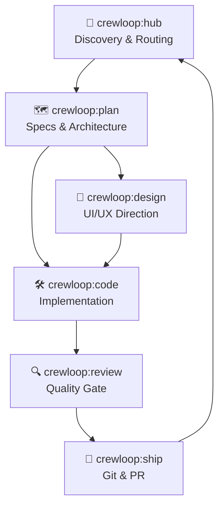

# What is CrewLoop?

CrewLoop is a team of AI skills that work together as a complete, role-separated software development workflow — from requirements discovery to git push — ensuring no step is skipped and every change is traceable.

Instead of asking a single AI to "build this feature", CrewLoop distributes responsibilities across 8 specialized skills. Each skill owns one phase and never invades another's territory.

## The crew at a glance

### Core Skills — mandatory in every task

| Skill | Phase | What it does |
|-------|-------|--------------|
| **`crewloop:hub`** | Discovery | Gathers context, asks the right questions, routes the task |
| **`crewloop:plan`** | Specs | Creates mandatory specs and architectural contracts |
| **`crewloop:design`** | Design | Defines aesthetic direction for every UI change |
| **`crewloop:code`** | Build | Writes implementation code and tests — the only one who does |
| **`crewloop:review`** | Review | Audits quality, security, and spec compliance |
| **`crewloop:ship`** | Ship | The only skill allowed to touch git |

### Supporting Skills — invoked as needed

| Skill | Invoked when |
|-------|-------------|
| **`crewloop:brainstorm`** | New or ambiguous project ideas need interactive discovery before specs |
| **`crewloop:docs`** | Pure documentation tasks without code changes |

## The flow

## What CrewLoop is not

- **Not a single AI assistant.** It is a structured workflow enforced through skill files.
- **Not a build tool.** It does not compile, bundle, or deploy your application.
- **Not opinionated about your stack.** Use any language, framework, or platform — the crew adapts.

## Next steps

→ [Why CrewLoop?](./why-crewloop) — the problem it solves  
→ [Installation](./installation) — get the skills into your agent in 60 seconds
