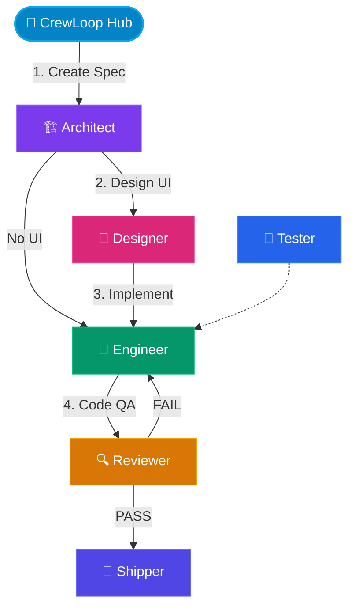

# Workflow Integration Testing

---

`[ Tool Guide ]`

Integration testing in a multi-agent environment verifies strict role boundaries and precise handoffs across the direct-routing workflow. Interactive phases load the selected next skill directly; AFK mode returns every transition through CrewLoop Hub. This guide validates both paths from discovery through shipping.

## Direct-Routing Flowchart

CrewLoop Hub owns task entry. Outside AFK, core skills route directly to the next phase and supporting skills return to their invoker.

### Flowchart Legend

| Role Badge | Primary Theme Color | Node Geometry | Meaning / Phase |
| :---: | :--- | :---: | :--- |
| `🎯 CrewLoop Hub` | Cyan / Sky Blue (`#0284c7`) | Double Rounded Pill | Central router, context discovery and phase controller |
| `🏗️ Architect` | Violet / Purple (`#7c3aed`) | Square Box | Specification writer, task list and contract creator |
| `🎨 Designer` | Magenta / Pink (`#db2777`) | Square Box | UI / UX visual spec designer and layout controller |
| `🔧 Engineer` | Emerald / Green (`#059669`) | Square Box | Core implementation, builds, and test suites manager |
| `🔍 Reviewer` | Amber / Gold (`#d97706`) | Square Box | Verification code reviews, security scanning gate |
| `🧪 Tester` | Blue / Sapphire (`#2563eb`) | Square Box | Functional validation and sanity checker |
| `🚀 Shipper` | Indigo (`#4f46e5`) | Square Box | Git branch, commit, push and PR controller |

---

## 1. CrewLoop Hub Discovery Phase

- **Objective**: Initiate the session, gather initial context, and formulate the routing plan.
- **Inputs**: The initial user request, project brief, and active code repositories.
- **Verification Steps**:
  1. Confirm the CrewLoop Hub starts with the standard role prefix (`> 🎯 **CrewLoop Hub**`).
  2. Verify that the Context Brief table is populated.
  3. Ensure a clear routing decision to the **Architect** is recommended.

### Deliverables & Boundary Verification
| Phase | Key Input Path | Key Output Path | Validation Rules |
| :---: | :--- | :--- | :--- |
| **🎯 CrewLoop Hub** | Initial prompt | `specs/changes/NNN/.spec.yaml` | Verify context brief contains target files |

:::info
**Routing Transition**: After discovery, present the entry menu and load **🏗️ Architect** after the user selects it. In AFK mode, the Hub loads Architect automatically.
:::

---

## 2. Architect Specification Phase

- **Objective**: Design the architecture, define system contracts, and establish implementation checklists.
- **Inputs**: The CrewLoop Hub's Context Brief and existing domain boundaries.
- **Verification Steps**:
  1. Verify the `specs/changes/NNN-name/` directory is created.
  2. Confirm the existence and validity of `.spec.yaml`, `proposal.md`, `specs/`, `design.md`, and `tasks.md`.
  3. Ensure the Architect answers the 7 analysis questions.
  4. Verify the output follows the `Architect CLI Output` format.

### Deliverables & Boundary Verification
| Phase | Key Input Path | Key Output Path | Validation Rules |
| :---: | :--- | :--- | :--- |
| **🏗️ Architect** | Context Brief | `specs/changes/NNN-name/tasks.md` | Specs folder must be complete and YAML linted |

---

## 3. Designer Specification Phase

- **Objective**: Define visual style, layout structure, color tokens, and layout guidelines.
- **Inputs**: Spec folder created by the Architect.
- **Verification Steps**:
  1. Confirm the creation of `design.md` or visual specifications inside the spec folder.
  2. Check theme/mode tokens and ASCII wireframes.
  3. Verify the output follows the `Designer CLI Output` format.

### Deliverables & Boundary Verification
| Phase | Key Input Path | Key Output Path | Validation Rules |
| :---: | :--- | :--- | :--- |
| **🎨 Designer** | Specs Folder | `specs/changes/NNN-name/design.md` | Define visual style and layout components |

---

## 4. Engineer Implementation Phase

- **Objective**: Implement code according to specifications and write automated unit/integration tests.
- **Inputs**: Technical specifications and tasks checklist.
- **Verification Steps**:
  1. Confirm the Engineer completes implementation according to `tasks.md`.
  2. Run the build/compile task.
  3. Execute unit and integration tests.
  4. Verify the output follows the `Engineer CLI Output` format.

### Deliverables & Boundary Verification
| Phase | Key Input Path | Key Output Path | Validation Rules |
| :---: | :--- | :--- | :--- |
| **🔧 Engineer** | Tasks Checklist | Target source code and tests | Compilation must pass and TDD rules must be met |

:::tip
You can check if the workspace is valid by running `crewloop install --dry-run` or check for compilation issues by running `npm run build` in the package directory.
:::

---

## 5. Reviewer Quality Assurance Phase

- **Objective**: Perform quality, safety, security, and compliance verification.
- **Inputs**: Target code diff and complete files.
- **Verification Steps**:
  1. Verify the Reviewer reviews the full files, not just diffs.
  2. Check for security risks, secret leaks, and console logs.
  3. Ensure the verdict is clearly stated (`PASS`, `PASS WITH WARNINGS`, or `FAIL`).
  4. Verify the output follows the `Reviewer CLI Output` format.

### Deliverables & Boundary Verification
| Phase | Key Input Path | Key Output Path | Validation Rules |
| :---: | :--- | :--- | :--- |
| **🔍 Reviewer** | Target Code Diff | Review Report (CLI Output) | Code styling, TDD adherence, and security checks |

:::warning
Never commit active `.env` files or plaintext credentials to the repository. Reviewers must flag these as critical errors.
:::

---

## 6. Tester Validation Phase

- **Objective**: Validate the functional requirements, layout correctness, and responsiveness of changes.
- **Inputs**: Implemented page or visual code.
- **Verification Steps**:
  1. Check page functionality and layout rendering.
  2. Validate links, headers, and metadata.
  3. Check console logs for errors.

### Deliverables & Boundary Verification
| Phase | Key Input Path | Key Output Path | Validation Rules |
| :---: | :--- | :--- | :--- |
| **🧪 Tester** | Live UI / Visuals | Validation Report | Verify cross-browser styling and click targets |

---

## Integration Test Success Criteria

To declare the workflow integration test complete and correct, the following artifacts and validation actions must be fulfilled:

| Phase | Main Deliverable | Verification Tool/Action |
|---|---|---|
| **CrewLoop Hub** | Context Brief | Check table correctness and routing output |
| **Architect** | Spec Files Folder | Lint YAML and verify file presence |
| **Designer** | UI/UX Visual Spec | Check theme tokens and ASCII layout |
| **Engineer** | Completed Code & Tests | Run compile and execution tests |
| **Reviewer** | Quality Report | Review code diff coverage & security threats |
| **Tester** | Visual/Functional Verification | Manual page test & link sanity |
