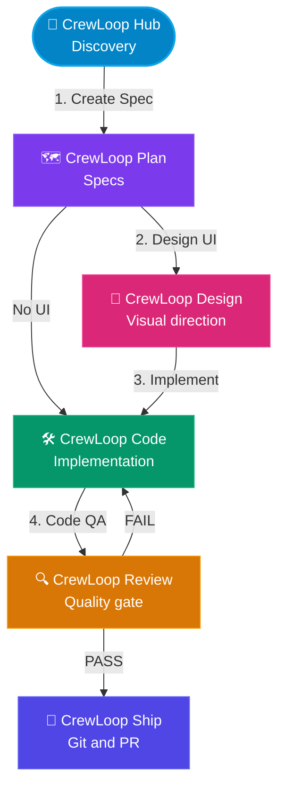

# Workflow Integration Testing

---

`[ Tool Guide ]`

Integration testing in a multi-agent environment verifies strict role boundaries and precise handoffs across the direct-routing workflow. Interactive phases load the selected next skill directly; AFK mode returns every transition through `crewloop:hub`. This guide validates both paths from discovery through shipping.

## Direct-Routing Flowchart

`crewloop:hub` owns task entry. Outside AFK, core skills route directly to the next phase and supporting skills return to their invoker.

```mermaid
flowchart TD
    %% Node Definitions
    O(["🎯 CrewLoop Hub<br/>Discovery"]):::crewloop-hub
    P["🗺️ CrewLoop Plan<br/>Specs"]:::crewloop-plan
    D["🎨 CrewLoop Design<br/>Visual direction"]:::crewloop-design
    C["🛠️ CrewLoop Code<br/>Implementation"]:::crewloop-code
    R["🔍 CrewLoop Review<br/>Quality gate"]:::crewloop-review
    S["🚀 CrewLoop Ship<br/>Git and PR"]:::crewloop-ship

    O -->|1. Create Spec| P
    P -->|2. Design UI| D
    P -->|No UI| C
    D -->|3. Implement| C
    C -->|4. Code QA| R
    R -->|PASS| S
    R -->|FAIL| C

    %% Class Definitions (CSS Theme Variables & Contrast Safe Colors)
    classDef default fill:#1e293b,stroke:#475569,stroke-width:1px,color:#f8fafc;
    classDef crewloop-hub fill:#0284c7,stroke:#0ea5e9,stroke-dasharray: 0,color:#ffffff,stroke-width:2px;
    classDef crewloop-plan fill:#7c3aed,stroke:#8b5cf6,color:#ffffff,stroke-width:1px;
    classDef crewloop-design fill:#db2777,stroke:#ec4899,color:#ffffff,stroke-width:1px;
    classDef crewloop-code fill:#059669,stroke:#10b981,color:#ffffff,stroke-width:1px;
    classDef crewloop-review fill:#d97706,stroke:#f59e0b,color:#ffffff,stroke-width:1px;
    classDef crewloop-ship fill:#4f46e5,stroke:#6366f1,color:#ffffff,stroke-width:1px;
```

### Flowchart Legend

| Role Badge | Primary Theme Color | Node Geometry | Meaning / Phase |
| :---: | :--- | :---: | :--- |
| `🎯 CrewLoop Hub` | Cyan / Sky Blue (`#0284c7`) | Double Rounded Pill | Central router, context discovery and phase controller |
| `🗺️ CrewLoop Plan` | Violet / Purple (`#7c3aed`) | Square Box | Specification writer, task list and contract creator |
| `🎨 CrewLoop Design` | Magenta / Pink (`#db2777`) | Square Box | UI / UX visual spec author and layout controller |
| `🛠️ CrewLoop Code` | Emerald / Green (`#059669`) | Square Box | Core implementation, builds, and test suites manager |
| `🔍 CrewLoop Review` | Amber / Gold (`#d97706`) | Square Box | Verification code reviews, security scanning gate |
| `🚀 CrewLoop Ship` | Indigo (`#4f46e5`) | Square Box | Git branch, commit, push and PR controller |

---

## 1. CrewLoop Hub Discovery Phase

- **Objective**: Initiate the session, gather initial context, and formulate the routing plan.
- **Inputs**: The initial user request, project brief, and active code repositories.
- **Verification Steps**:
  1. Confirm the CrewLoop Hub starts with the standard role prefix (`> 🎯 **CrewLoop Hub**`).
  2. Verify that the Context Brief table is populated.
  3. Ensure a clear routing decision to `crewloop:plan` is recommended.

### Deliverables & Boundary Verification
| Phase | Key Input Path | Key Output Path | Validation Rules |
| :---: | :--- | :--- | :--- |
| **🎯 CrewLoop Hub** | Initial prompt | `specs/features/<domain>/spec-NN-name.md` | Verify context brief contains target files |

:::info
**Routing Transition**: After discovery, present the entry menu and load **`crewloop:plan`** after the user selects it. In AFK mode, the Hub loads `crewloop:plan` automatically.
:::

---

## 2. CrewLoop Plan Specification Phase

- **Objective**: Design the architecture, define system contracts, and establish acceptance criteria.
- **Inputs**: Project memory (`specs/memory/project-state.md`) and the task request.
- **Verification Steps**:
  1. Verify a single-file feature spec `specs/features/<domain>/spec-NN-name.md` is created.
  2. Confirm it contains Objective, Context, Requirements, Behavior/Flow, Constraints, Edge Cases, Acceptance Criteria (AC-01…), and Done When.
  3. Ensure `crewloop:plan` updates `specs/memory/project-state.md`.
  4. Verify the output follows the `CrewLoop Plan CLI Output` format.

### Deliverables & Boundary Verification
| Phase | Key Input Path | Key Output Path | Validation Rules |
| :---: | :--- | :--- | :--- |
| **`crewloop:plan`** | Context Brief | `specs/features/<domain>/spec-NN-name.md` | Feature spec must be complete, edge cases covered, ACs testable |

---

## 3. CrewLoop Design Specification Phase

- **Objective**: Define visual style, layout structure, color tokens, and layout guidelines.
- **Inputs**: Feature spec created by `crewloop:plan`.
- **Verification Steps**:
  1. Confirm design detail is added to the feature spec (or a `design.md` sub-spec in the same feature folder for large UI).
  2. Check theme/mode tokens and ASCII wireframes.
  3. Verify the output follows the `CrewLoop Design CLI Output` format.

### Deliverables & Boundary Verification
| Phase | Key Input Path | Key Output Path | Validation Rules |
| :---: | :--- | :--- | :--- |
| **`crewloop:design`** | Feature Spec | `specs/features/<domain>/spec-NN-name.md` (+ optional design sub-spec) | Define visual style and layout components |

---

## 4. CrewLoop Code Implementation Phase

- **Objective**: Implement code according to specifications and write automated unit/integration tests.
- **Inputs**: Feature spec (Requirements, Edge Cases, Done When).
- **Verification Steps**:
  1. Confirm `crewloop:code` implements per the feature spec and ticks Done When items it proved.
  2. Run the build/compile task.
  3. Execute unit and integration tests.
  4. Verify the output follows the `CrewLoop Code CLI Output` format.

### Deliverables & Boundary Verification
| Phase | Key Input Path | Key Output Path | Validation Rules |
| :---: | :--- | :--- | :--- |
| **`crewloop:code`** | Feature Spec | Target source code and tests | Compilation must pass and TDD rules must be met |

:::tip
You can check if the workspace is valid by running `crewloop install --dry-run` or check for compilation issues by running `npm run build` in the package directory.
:::

---

## 5. CrewLoop Review Quality Assurance Phase

- **Objective**: Perform quality, safety, security, and compliance verification.
- **Inputs**: Target code diff and complete files.
- **Verification Steps**:
  1. Verify `crewloop:review` reviews the full files, not just diffs.
  2. Check for security risks, secret leaks, and console logs.
  3. Ensure the verdict is clearly stated (`PASS`, `PASS WITH WARNINGS`, or `FAIL`).
  4. Verify the output follows the `CrewLoop Review CLI Output` format.

### Deliverables & Boundary Verification
| Phase | Key Input Path | Key Output Path | Validation Rules |
| :---: | :--- | :--- | :--- |
| **`crewloop:review`** | Target Code Diff | Review Report (CLI Output) | Code styling, TDD adherence, and security checks |

:::warning
Never commit active `.env` files or plaintext credentials to the repository. `crewloop:review` must flag these as critical errors.
:::

---

## Integration Test Success Criteria

To declare the workflow integration test complete and correct, the following artifacts and validation actions must be fulfilled:

| Phase | Main Deliverable | Verification Tool/Action |
|---|---|---|
| **CrewLoop Hub** | Context Brief | Check table correctness and routing output |
| **`crewloop:plan`** | Spec Files Folder | Lint YAML and verify file presence |
| **`crewloop:design`** | UI/UX Visual Spec | Check theme tokens and ASCII layout |
| **`crewloop:code`** | Completed Code & Tests | Run compile and execution tests |
| **`crewloop:review`** | Quality Report | Review code diff coverage & security threats |
| **`crewloop:ship`** | Git branch, commit, PR | Verify branch, commit message, and completed feature spec (status: completed) |
