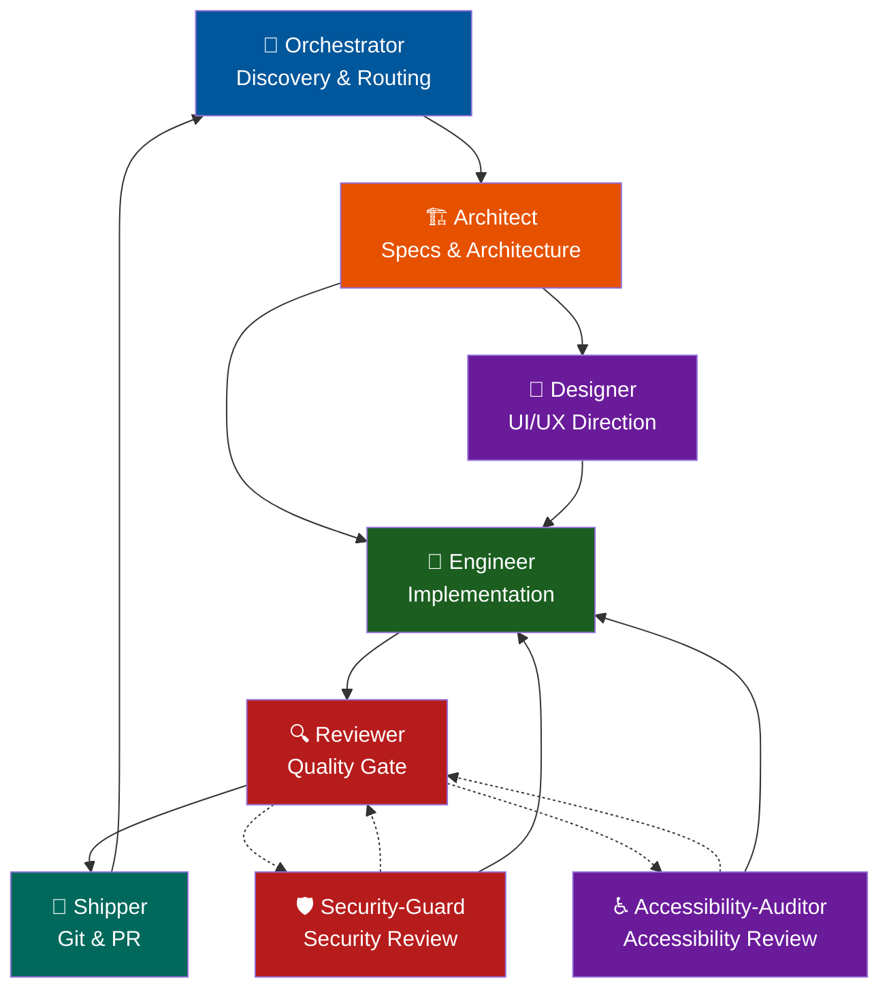

# Workflow Reference

Complete workflow for the Loop Engineering Agents team.

---

## Team Roles

| Role | File | Responsibility |
|------|------|----------------|
| Orchestrator | `skills/orchestrator/SKILL.md` | Context discovery and routing |
| Architect | `skills/architect/SKILL.md` | Specs, contracts, architecture |
| Designer | `skills/designer/SKILL.md` | Visual/UI direction |
| Engineer | `skills/engineer/SKILL.md` | Implementation and tests |
| Reviewer | `skills/reviewer/SKILL.md` | Code review and quality gate |
| Shipper | `skills/shipper/SKILL.md` | Git operations and PR |
| Security-Guard | `skills/security-guard/SKILL.md` | Deep-dive security review |
| Accessibility-Auditor | `skills/accessibility-auditor/SKILL.md` | Accessibility and WCAG review |

---

## Flow Diagram

---

## Routing Rules

1. **Orchestrator ALWAYS sends to Architect first** — never directly to Designer or Engineer.
2. **Architect is the gatekeeper** — creates specs and routes to Designer (UI) or Engineer (code).
3. **Designer acts BEFORE Engineer** — visual spec before implementation.
4. **Engineer never does git or review** — routes to Reviewer after BUILD.
5. **Reviewer is the quality gate** — routes to Shipper if clean, or back to Engineer/Architect if issues are found.
6. **Security-Guard and Accessibility-Auditor are optional review specialists** — invoked by the Orchestrator or Reviewer when the change involves security-sensitive work or UI accessibility. They report findings back to the Engineer or Reviewer and do not touch git.
7. **Shipper is the only one who touches git** — commit, branch, push, PR.
8. **All skills return to Orchestrator** — it is the central hub.

