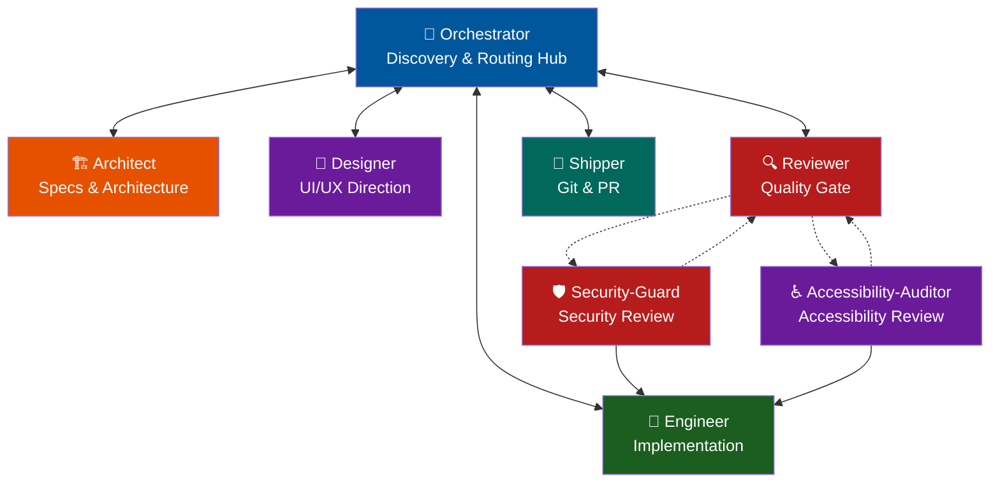

# Workflow Reference

Complete workflow for the Loop Engineering Agents team.

---

## Team Roles

| Role | File | Responsibility |
|------|------|----------------|
| Orchestrator | `skills/orchestrator/SKILL.md` | Context discovery and routing |
| Architect | `skills/architect/SKILL.md` | Specs, contracts, architecture |
| Designer | `skills/designer/SKILL.md` | Visual/UI direction |
| Engineer | `skills/engineer/SKILL.md` | Implementation and tests |
| Reviewer | `skills/reviewer/SKILL.md` | Code review and quality gate |
| Shipper | `skills/shipper/SKILL.md` | Git operations and PR |
| Security-Guard | `skills/security-guard/SKILL.md` | Deep-dive security review |
| Accessibility-Auditor | `skills/accessibility-auditor/SKILL.md` | Accessibility and WCAG review |

---

## Flow Diagram (Hub-and-Spoke)

All execution skills return control to the Orchestrator. The Orchestrator manages the task state and routes to the next step.

---

## Routing Rules

1. **Orchestrator is the Central Hub** — every agent hands control back to Orchestrator at the end of their turn.
2. **Orchestrator ALWAYS sends to Architect first** — to create or update specifications.
3. **Architect is the design gatekeeper** — once the spec is created, they return control to Orchestrator, which routes to Designer (for UI) or Engineer (for code).
4. **Designer acts BEFORE Engineer** — visual spec is designed, control returns to Orchestrator, which then routes to Engineer.
5. **Engineer never does git or review** — implements code/tests, then returns control to Orchestrator, which routes to Reviewer.
6. **Reviewer is the quality gate** — reviews changes, returns control to Orchestrator. If approved, Orchestrator routes to Shipper; if changes needed, Orchestrator routes back to Engineer.
7. **Security-Guard and Accessibility-Auditor are optional review specialists** — invoked by the Orchestrator or Reviewer when the change involves security-sensitive work or UI accessibility. They report findings back and do not touch git.
8. **Shipper is the only one who touches git** — performs branch, commit, push, PR, and returns control to Orchestrator.
