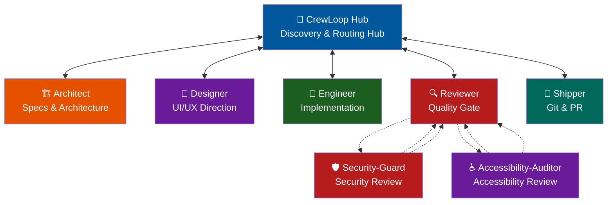

# Workflow Reference

Complete workflow for the Loop Engineering Agents team.

---

## Team Roles

| Role | File | Responsibility |
|------|------|----------------|
| CrewLoop Hub | `skills/crewloop-hub/SKILL.md` | Context discovery and routing |
| Architect | `skills/architect/SKILL.md` | Specs, contracts, architecture |
| Designer | `skills/designer/SKILL.md` | Visual/UI direction |
| Engineer | `skills/engineer/SKILL.md` | Implementation and tests |
| Reviewer | `skills/reviewer/SKILL.md` | Code review and quality gate |
| Shipper | `skills/shipper/SKILL.md` | Git operations and PR |
| Maintainer | `skills/maintainer/SKILL.md` | Bug triage and technical debt |
| Docs Writer | `skills/docs-writer/SKILL.md` | Documentation-only changes |
| Tester | `skills/tester/SKILL.md` | QA strategy and coverage analysis |
| Product Manager | `skills/product-manager/SKILL.md` | Prioritization and success metrics |
| Researcher | `skills/researcher/SKILL.md` | Technology evaluation and comparison |
| Security-Guard | `skills/security-guard/SKILL.md` | Deep-dive security review |
| Accessibility-Auditor | `skills/accessibility-auditor/SKILL.md` | Accessibility and WCAG review |
| Long-Term Manager | `skills/long-term-manager/SKILL.md` | Durable tracking for multi-session projects |
| Frontend Architect | `skills/frontend-architect/SKILL.md` | Frontend component architecture and React state boundaries |
| Schema Designer | `skills/schema-designer/SKILL.md` | Database schema and API contract design |
| DevOps Specialist | `skills/devops-specialist/SKILL.md` | Release automation and infrastructure validation |

---

## Flow Diagram (Hub-and-Spoke)

All execution skills return control to the CrewLoop Hub. The CrewLoop Hub manages the task state and routes to the next step.

---

## Routing Rules

1. **CrewLoop Hub is the Central Hub** — every agent hands control back to CrewLoop Hub at the end of their turn.
2. **CrewLoop Hub ALWAYS sends to Architect first** — to create or update specifications.
3. **Architect is the design gatekeeper** — once the spec is created, they return control to CrewLoop Hub, which routes to Designer (for UI) or Engineer (for code).
4. **Designer acts BEFORE Engineer** — visual spec is designed, control returns to CrewLoop Hub, which then routes to Engineer.
5. **Engineer never does git or review** — implements code/tests, then returns control to CrewLoop Hub, which routes to Reviewer.
6. **Reviewer is the quality gate** — reviews changes, returns control to CrewLoop Hub. If approved, CrewLoop Hub routes to Shipper; if changes needed, CrewLoop Hub routes back to Engineer.
7. **Security-Guard and Accessibility-Auditor are optional review specialists** — invoked by the CrewLoop Hub or Reviewer when the change involves security-sensitive work or UI accessibility. They report findings back to the invoking skill and do not touch git.
8. **Shipper is the only one who touches git** — performs branch, commit, push, PR, and returns control to CrewLoop Hub.
9. **Bug-Fixing Pipeline** — Triaging and reproduction are handled by the Maintainer, who yields to the CrewLoop Hub. The CrewLoop Hub routes to the Architect to create a lightweight specification (`.spec.yaml` + `tasks.md`), then to the Engineer for implementation and testing, to the Reviewer for verification, and to the Shipper to commit/ship and archive the spec.
10. **Specialist Helpers** — When a task clearly needs frontend architecture, schema design, or release automation support, route the relevant core skill and let it invoke `frontend-architect`, `schema-designer`, or `devops-specialist` as a subskill helper.
