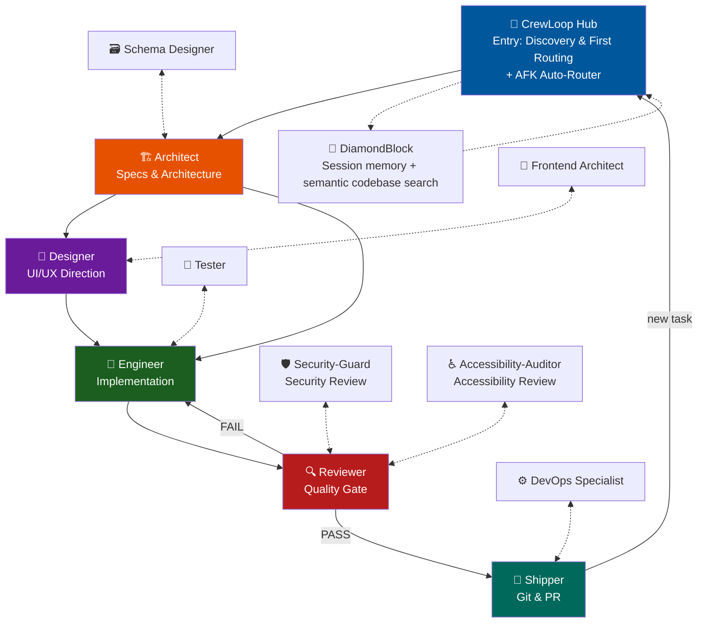

# Workflow Reference

Complete workflow for the Loop Engineering Agents team.

---

## Team Roles

| Role | File | Responsibility |
|------|------|----------------|
| CrewLoop Hub | `skills/crewloop-hub/SKILL.md` | Entry point: context discovery and first routing; AFK auto-router |
| Architect | `skills/architect/SKILL.md` | Specs, contracts, architecture |
| Designer | `skills/designer/SKILL.md` | Visual/UI direction |
| Engineer | `skills/engineer/SKILL.md` | Implementation and tests |
| Reviewer | `skills/reviewer/SKILL.md` | Code review and quality gate |
| Shipper | `skills/shipper/SKILL.md` | Git operations and PR |
| Maintainer | `skills/maintainer/SKILL.md` | Bug triage and technical debt |
| Project Brainstorm | `skills/project-brainstorm/SKILL.md` | Interactive discovery for ambiguous project ideas |
| Docs Writer | `skills/docs-writer/SKILL.md` | Documentation-only changes |
| Tester | `skills/tester/SKILL.md` | QA strategy and coverage analysis |
| Product Manager | `skills/product-manager/SKILL.md` | Prioritization and success metrics |
| Researcher | `skills/researcher/SKILL.md` | Technology evaluation and comparison |
| Security-Guard | `skills/security-guard/SKILL.md` | Deep-dive security review |
| Accessibility-Auditor | `skills/accessibility-auditor/SKILL.md` | Accessibility and WCAG review |
| Long-Term Manager | `skills/long-term-manager/SKILL.md` | Durable tracking for multi-session projects |
| Frontend Architect | `skills/frontend-architect/SKILL.md` | Frontend component architecture and React state boundaries |
| Schema Designer | `skills/schema-designer/SKILL.md` | Database schema and API contract design |
| DevOps Specialist | `skills/devops-specialist/SKILL.md` | Release automation and infrastructure validation |
| DiamondBlock | `skills/diamondblock/SKILL.md` | Default discovery helper for session memory, context retrieval, and semantic codebase search |

---

## Flow Diagram (Direct Routing)

Skills hand off directly to the next skill via their ending menu; the user confirms each
transition. The CrewLoop Hub mediates only at task entry and in AFK mode.

---

## Routing Rules

1. **CrewLoop Hub is the entry point** — it may use approved discovery/tracking helpers,
   then routes to Architect as the first mandatory delivery phase. Outside AFK mode, it
   does not mediate mid-flow transitions.
2. **DiamondBlock is the default read-only discovery layer** — when configured and
   installed, the Hub uses DiamondBlock before any broad manual inspection to retrieve
   session memory, prior decisions, semantic codebase search results, and other read-only
   context.
3. **Interactive skills route directly** — each interactive skill presents valid next-step options
   from its position in the flow (transition contract in `conventions.md`), with one
   outcome-driven option marked `(Recommended)`. The user picks; the skill continues
   directly into the chosen next skill.
4. **Architect is ALWAYS the first stop** — every task (bug fix, feature, design,
   refactor) gets a spec before implementation. Architect is non-interactive and hands off
   directly to Designer (UI) or Engineer.
5. **Designer acts BEFORE Engineer** — when the change involves UI, Designer hands off
   directly to Engineer.
6. **Engineer never does git or review** — implements code/tests, then its menu offers
   Reviewer (recommended), keep implementing, or back to Architect, then continues directly
   into the selected route.
7. **Reviewer is the quality gate** — verdict drives the menu: PASS → Shipper
   (recommended); FAIL → Engineer (recommended), then continues directly into the selected route.
8. **Security-Guard and Accessibility-Auditor are review specialists** — invoked by the
   Reviewer; they end by recommending a return to the Reviewer.
9. **Shipper is the only one who touches git** — after shipping, its menu offers a new
   task (CrewLoop Hub entry) or done, then continues directly into the selected route.
10. **Bug-Fixing Pipeline** — Maintainer triages and reproduces, then hands off directly to
   Architect with a lightweight specification (`.spec.yaml` + `tasks.md`); from there the
   standard chain applies: Architect → Engineer → Reviewer → Shipper.
11. **Specialist Helpers return to their invoker** — `schema-designer` → Architect,
    `frontend-architect` → Designer, `devops-specialist` → Shipper, and `tester` / `docs-writer` → Engineer when invoked during delivery.
    Maintainer and Project Brainstorm instead route confirmed triage/completed briefs to Architect.
12. **AFK mode is the exception** — with AFK active, every non-Hub skill returns control to the
    CrewLoop Hub automatically and the Hub loads the next skill per the transition
    contract, with no menus.

---

## AFK Flow

1. Non-Hub skill finishes → loads CrewLoop Hub automatically (Skill tool)
2. Hub evaluates state → loads next skill per the transition contract
3. No menus; role prefixes on every response
4. Ends when Shipper completes and returns to the Hub
