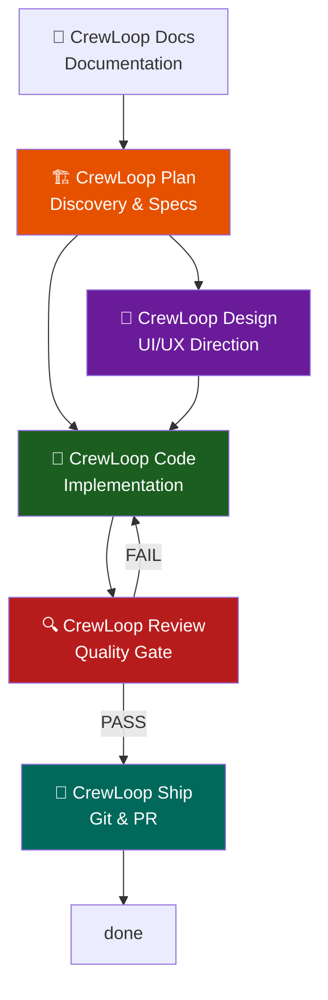

# Workflow Reference

Complete workflow for the CrewLoop team.

---

## Team Roles

| Role | File | Responsibility |
|------|------|----------------|
| CrewLoop Plan | `skills/crewloop-plan/SKILL.md` | Entry point: discovery, brief synthesis, spec creation, and routing |
| CrewLoop Design | `skills/crewloop-design/SKILL.md` | Visual/UI direction |
| CrewLoop Code | `skills/crewloop-code/SKILL.md` | Implementation and tests |
| CrewLoop Review | `skills/crewloop-review/SKILL.md` | Code review and quality gate |
| CrewLoop Ship | `skills/crewloop-ship/SKILL.md` | Git operations and PR |
| CrewLoop Docs | `skills/crewloop-docs/SKILL.md` | Documentation-only changes |

---

## Flow Diagram (Auto-Routing)

Skills hand off automatically to the next skill per the transition contract. The user can
interrupt the flow with explicit commands. `crewloop:plan` is the entry point for new tasks
and the AFK fallback router.

```mermaid
flowchart TD
    P["🏗️ CrewLoop Plan<br>Discovery & Specs"] --> D["🎨 CrewLoop Design<br>UI/UX Direction"]
    P --> C["🔧 CrewLoop Code<br>Implementation"]
    D --> C
    C --> R["🔍 CrewLoop Review<br>Quality Gate"]
    R -->|PASS| S["🚀 CrewLoop Ship<br>Git & PR"]
    R -->|FAIL| C
    S --> done

    DO["📝 CrewLoop Docs<br>Documentation"] --> P

    style P fill:#e65100,color:#fff
    style D fill:#6a1b9a,color:#fff
    style C fill:#1b5e20,color:#fff
    style R fill:#b71c1c,color:#fff
    style S fill:#00695c,color:#fff
```

---

## Routing Rules

1. **`crewloop:plan` is the entry point** — every session starts here. It routes to `crewloop:design` if the change involves UI, otherwise to `crewloop:code`.
2. **Skills route automatically** — each skill evaluates its outcome and hands off directly to the next skill per the transition contract. No end-of-skill menus.
3. **User interrupts are explicit** — recognized commands are `stop`, `pause`, `volta`, `voltar`, and `re-analyze`. Any of these halts the flow and returns to `crewloop:plan`.
4. **`crewloop:plan` is ALWAYS the first stop** — every task (bug fix, feature, design, refactor) gets a spec before implementation. `crewloop:plan` is interactive during discovery but auto-routes once the spec is ready.
5. **`crewloop:design` acts BEFORE `crewloop:code`** — when the change involves UI, `crewloop:design` hands off directly to `crewloop:code`.
6. **`crewloop:code` never does git or review** — implements code/tests, then auto-routes to `crewloop:review` on success or back to `crewloop:plan` after a failed build that could not be fixed.
7. **`crewloop:review` is the quality gate** — verdict drives the route: PASS → `crewloop:ship`; FAIL → `crewloop:code`.
8. **`crewloop:ship` is the only skill that touches git** — commit, branch, push, and PR. After shipping it routes to `done`.
9. **`crewloop:docs` supports documentation tasks** — invoked on demand, returns to `crewloop:plan` when done.
10. **Specs are archived** — the `specs/changes/` folder is moved to `specs/archive/` on commit by `crewloop:ship`.
11. **Bug fixes enter via `crewloop:plan`** — bug fixes are triaged like any other task through the Plan skill.
12. **AFK mode is Plan-driven** — with AFK active, every skill returns to `crewloop:plan` automatically, and Plan loads the next skill per the transition contract, with no menus.

---

## AFK Flow

1. Skill finishes → returns to `crewloop:plan` automatically.
2. `crewloop:plan` evaluates state → loads next skill per the transition contract.
3. No menus; role prefixes on every response.
4. Ends when `crewloop:ship` completes and returns to `crewloop:plan`.
