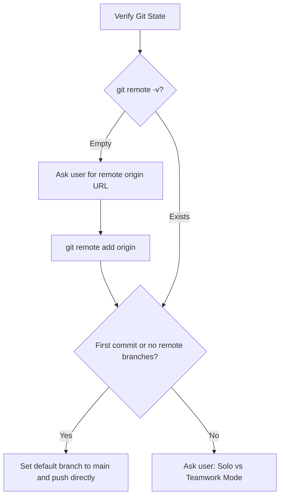
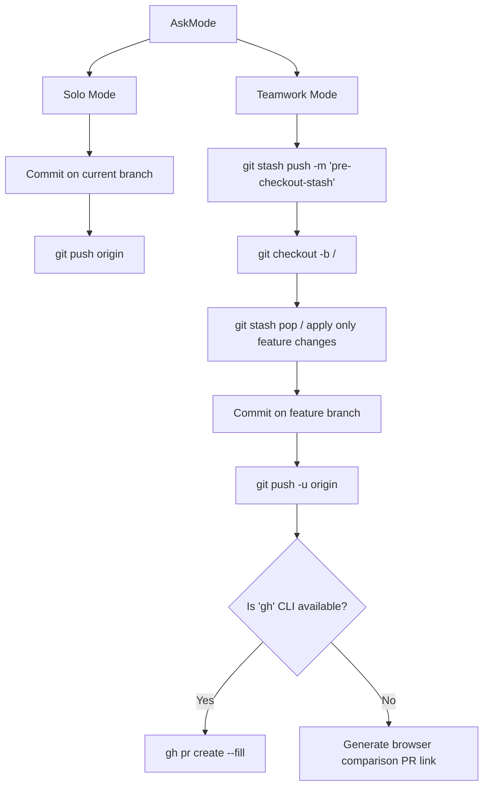

# Design: Smart Shipper Git Flow

## Git Operation & Decision Workflows

### 1. Verification of Remote State


### 2. Solo vs Teamwork Mode Decision


---

## Technical Interface / UI Format

### Change Category Report Template
```markdown
## 📦 Ready to Ship

### 🎯 Feature / Fix Changes (Target Task)
| File | Status | Lines | Description |
|------|--------|-------|-------------|
| `src/main.ts` | Modified | +20 -5 | Implemented feature requirements |

### 📁 Pre-existing / Unrelated Changes
| File | Status | Lines | Description |
|------|--------|-------|-------------|
| `config.json` | Modified | +2 -2 | Local database settings changed prior to task |

**Total:** 2 files, +22 -7

### Proposed Branch
`feat/my-awesome-feature`
```
