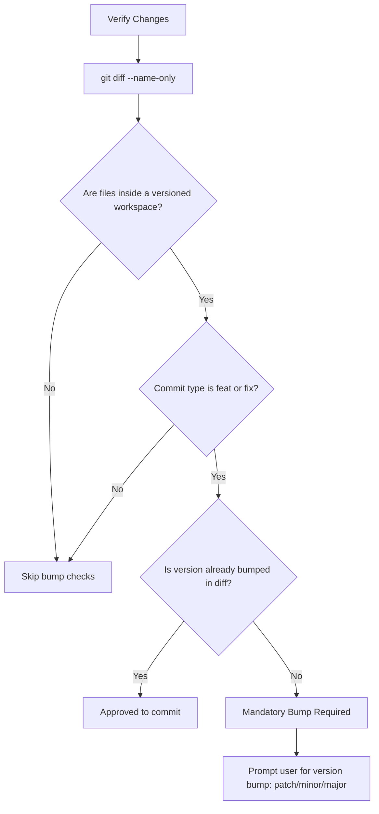

# Design: Clean Orchestrator Brief and Shipper Version Bumps

## 1. Simplified Brief Template Blueprint

```markdown
## Task Brief

- **Type:** [feature | modification | bugfix | refactor | docs]
- **Scope:** [new | existing codebase]
- **Priority:** [P0 | P1 | P2]

### Objective
[1-2 sentences summarizing the core goal]

### Requirements
- [ ] Requirement 1

### Affected Files
- `path/to/file`

[Only include below sections if populated/relevant]

### Design & Visuals
- Style/Color: ...
- Layout: ...

### Technical Specs
- State/Data flow: ...
```

---

## 2. Shipper Version Bump Verification Logic


