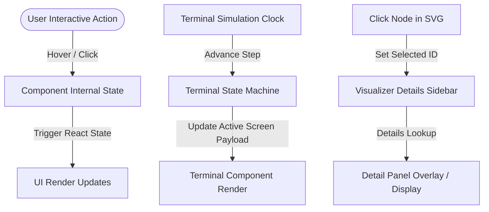

# Design Specification: Ultra-Premium Glassmorphic 3D Homepage

## 🏗️ Architecture Overview

The homepage redesign applies a **Component-Driven Architecture (CDA)** with a separation of concern between the visual state controllers (typewriters, simulations, dynamic networks) and the layout containers. Styling is centralized using custom HSL CSS variables, ensuring maximum design token consistency and reusability.

---

## 🧱 [Padrões Aplicados]

- **Design Token Encapsulation (CSS Custom Properties)**: Rather than writing inline ad-hoc glassmorphic values, styling is governed by custom variables (e.g., `--glass-blur`, `--glass-bg`, `--glow-cyan`). This ensures that changes to the glass intensity or glow radius propagate cleanly through all components.
- **State Machine Pattern (Terminal Simulator)**: The terminal simulator is engineered using a finite state machine representation. The terminal advances through predefined step definitions (`terminalSteps`), handling transitions, delayed typewriting outputs, and command prompt lines safely.
- **Strategy Pattern (Step Renderer)**: A renderer mapping matches step execution payloads to specific terminal displays (e.g., executing a command, displaying log reports, showing file changes). This makes adding new simulation runs modular and decoupled from the React lifecycle.
- **Composite Component Pattern**: The landing page sections (Hero, Terminal, Skills Catalog, Comparison Grid) are assembled using composite structures where subcomponents manage their internal hover physics independently, reducing re-render bubbles.

---

## 🚀 [Estratégia de Implementação]

### 1. Data Flow & State Lifecycles
The data flows within the landing page are structured as follows:



### 2. Implementation Steps
- **Step 1: CSS and Tailwind Token Extension**: Write custom keyframes and variables for dynamic glows and animations (glow drift, card spring, text typewriter) in `index.css` and `tailwind.config.js`.
- **Step 2: Terminal Simulator Component**: Implement the state-driven terminal logic that runs asynchronously on render.
- **Step 3: SkillVisualizer SVG Paths**: Modify paths to bezier loops and incorporate the SVG animation dash-offset lines.
- **Step 4: Skills Catalog Grid**: Redesign the sidebar logic into interactive cards and grid layouts.
- **Step 5: Comparative Matrix**: Wrap traditional AI vs. CrewLoop in glass panels with glow pulsing animations.
- **Step 6: Performance Metrics & Testimonials**: Render the mock statistics cards with spring physical hover transformations.

---

## 🔌 Contracts & Stubs

The following interfaces and types govern the data structures for the landing page components:

### 1. Terminal Simulator Types

```typescript
export interface TerminalLine {
  id: string;
  type: 'input' | 'output' | 'success' | 'error' | 'header';
  text: string;
  delayBefore?: number; // MS to wait before typing/rendering
}

export interface TerminalStep {
  stepId: number;
  command: string; // The command typed in this step
  logs: TerminalLine[]; // The outputs generated after command execution
  durationAfter: number; // Idle time (ms) before advancing to next step
}

export interface TerminalSimulatorState {
  currentStepIndex: number;
  typedCommand: string;
  visibleLogs: TerminalLine[];
  status: 'idle' | 'typing' | 'running' | 'completed';
}
```

### 2. Skill Node & Handoff Connections Configuration

```typescript
export interface HandoffPath {
  from: string;
  to: string;
  curve: 'left' | 'right' | 'straight';
  isActive: boolean;
}

export interface SkillNodeRedesign {
  id: string;
  name: string;
  role: string;
  icon: React.ReactNode;
  themeColor: {
    border: string;
    text: string;
    bg: string;
    glow: string;
    pulse: string;
  };
  description: string;
  cannotDo: string[];
  metrics?: {
    label: string;
    value: string;
  };
}
```

### 3. Testimonial Card Schema

```typescript
export interface MetricTestimonial {
  id: string;
  statValue: string;
  statLabel: string;
  quote: string;
  agentRole: string; // The role that achieved the metric
  avatarSrc?: string;
}
```

---

## 🎨 Theme Tokens & Glassmorphic CSS Classes

The styles will be declared inside `docs/src/index.css`:

```css
@theme {
  --color-glass-bg: rgba(11, 10, 15, 0.65);
  --color-glass-border: rgba(38, 38, 38, 0.4);
  --glass-blur-amount: blur(16px);
}

/* Glassmorphic 3D Card Utility */
.glass-card-3d {
  background: var(--color-glass-bg);
  border: 1px solid var(--color-glass-border);
  backdrop-filter: var(--glass-blur-amount);
  -webkit-backdrop-filter: var(--glass-blur-amount);
  box-shadow: 
    0 4px 30px rgba(0, 0, 0, 0.1),
    inset 0 1px 1px rgba(255, 255, 255, 0.05),
    0 10px 50px -10px rgba(0, 0, 0, 0.5);
  transform-style: preserve-3d;
  perspective: 1000px;
}

/* Spring Hover Transitions */
.hover-spring-physics {
  transition: transform 0.4s cubic-bezier(0.175, 0.885, 0.32, 1.275), box-shadow 0.3s ease;
}

.hover-spring-physics:hover {
  transform: translateY(-6px) scale(1.02);
}

/* Background Glow Drift */
@keyframes glowDrift {
  0% {
    transform: translate(0px, 0px) scale(1);
  }
  33% {
    transform: translate(30px, -50px) scale(1.1);
  }
  66% {
    transform: translate(-20px, 20px) scale(0.95);
  }
  100% {
    transform: translate(0px, 0px) scale(1);
  }
}

.animate-glow-drift {
  animation: glowDrift 20s infinite ease-in-out;
}
```

---

## 🧪 Test Plan (Verification Strategy)

Per the **TDD Skip Criteria**, component layouts and CSS properties will not be unit-tested directly as they are primarily visual presentations. However, the simulation state machine and string utilities MUST be thoroughly verified:

### 1. Unit Tests (React Testing Library & Vitest)
- **Terminal Simulator State Machine**:
  - Test that the simulation transitions from `idle` to `typing` to `running` to `completed` in correct sequence.
  - Test that command typing progresses char-by-char at defined speeds.
  - Test that log lines appear only after the command completes.
- **Details Lookup**:
  - Test that selecting a node from the catalog returns the correct metadata and constraints list.

### 2. Visual Regression and Manual Verification
- Verify responsiveness across viewports (320px mobile up to 2560px ultra-wide displays).
- Test spring transitions on Chrome, Firefox, and Safari to guarantee webkit backdrop filter resilience.
- Verify color contrast ratios (WCAG AAA standard compatibility) on the comparative panel text against glass gradients.
