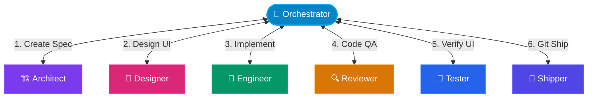

# Design Spec: Workflow Integration Test Page Layout

This design specification defines the visual hierarchy, layout rules, component structures, and aesthetic direction for the new `workflow-test.md` documentation page, ensuring it matches the premium developer-tool aesthetic of the CrewLoop documentation site.

---

## 1. Aesthetic Direction & Brand Narrative

- **Aesthetic Direction**: **Linear-like Minimalist** integrated with **Terminal Monospace** details.
- **Vibe**: High-performance developer tools, clean lines, clear hierarchy, high readability under both light and dark modes.
- **Visual Palette**: Neutral slate base (`#0f172a` / `#ffffff`) paired with a vibrant, color-coded role system to make complex multi-agent transitions immediately parsing-friendly.

---

## 2. Header & Frontmatter Presentation

The document header represents the first point of contact and must project structure and authority.

### Frontmatter Structure
```yaml
---
title: "Workflow Integration Testing"
sidebar_label: "Workflow Integration Testing"
sidebar_position: 3
---
```

### Presentation Guidelines
- **Title Layout**: Left-aligned H1 (`# Workflow Integration Testing`) followed by a horizontal separator line (`---`) which renders as a `1px` subtle divider (`--border`).
- **Lead Paragraph**: Styled with larger body font (`1.125rem` / `18px`), lighter font-weight (`300` or `400` muted depending on mode), and a comfortable line-height (`1.75`). It must be separated from the title by exactly `--space-md` (`16px`).
- **Category Badge**: A small inline badge formatted as code/label showing the category tag:
  `[ Tool Guide ]` or `<span class="badge badge--secondary">Tool Guide</span>` to denote its position in the developer suite.

---

## 3. Mermaid Flowchart Visual System

The Hub-and-Spoke transitions require a high-fidelity visual layout. The Mermaid flowchart must render clearly in both light and dark themes.

### Flowchart Structure & Styling



### Legend Definition (Aesthetic Details)

Below the diagram, a visual legend must represent the roles and node styles:

| Role Badge | Primary Theme Color | Node Geometry | Meaning / Phase |
| :---: | :--- | :---: | :--- |
| `🎯 Orchestrator` | Cyan / Sky Blue (`#0284c7`) | Double Rounded Pill | Central router, context discovery and phase controller |
| `🏗️ Architect` | Violet / Purple (`#7c3aed`) | Square Box | Specification writer, task list and contract creator |
| `🎨 Designer` | Magenta / Pink (`#db2777`) | Square Box | UI / UX visual spec designer and layout controller |
| `🔧 Engineer` | Emerald / Green (`#059669`) | Square Box | Core implementation, builds, and test suites manager |
| `🔍 Reviewer` | Amber / Gold (`#d97706`) | Square Box | Verification code reviews, security scanning gate |
| `🧪 Tester` | Blue / Sapphire (`#2563eb`) | Square Box | Functional validation and sanity checker |
| `🚀 Shipper` | Indigo (`#4f46e5`) | Square Box | Git branch, commit, push and PR controller |

### Contrast & Accessibility Rules
- Text inside nodes must use high contrast relative to background fills (minimum `4.5:1` contrast ratio).
- Node styles avoid pure red/green color coding for status; shape, label icons (emojis), and clear arrows signify direction.

---

## 4. Table Layout & Styling Guidelines

Tables contain dense input, output, and deliverable metadata. They must be clean and highly readable.

### Column Alignment & Wrapping
- **Phase/Role**: Centered (`:---:`), bold, decorated with corresponding role emoji.
- **Inputs & Outputs**: Left-aligned (`:---`), styled in monospace `code` format for file paths, parameters, or git branches.
- **Description / Requirements**: Left-aligned (`:---`). Plain markdown with links.
- **Status / Checkmark**: Centered (`:---:`), using active Markdown checkboxes (`- [ ]`) or icon indicators (`✅`, `⚠️`, `🛑`).

### Structure Example
```markdown
| Role Phase | Key Input Path | Key Output Path | Validation Rules |
| :---: | :--- | :--- | :--- |
| **🎯 Orchestrator** | Initial prompt | `specs/changes/NNN/.spec.yaml` | Verify context brief contains target files |
```

### Spacing & Grid Specs
- Solid grid lines enabled by standard Markdown pipes (`|`).
- Row height padding: minimum `8px` (`--space-sm`) top and bottom.
- Alternating row tints: Odd rows receive `--bg-primary` (`#ffffff` / `#0a0a0f`), even rows receive `--bg-surface` (`#f8fafc` / `#14141b`).

---

## 5. Callouts & Blockquotes Strategy

Visual callouts (Admonitions) are used strategically to emphasize pipeline transitions, warnings, and implementation guidelines. They should not be used consecutively.

### Callout Category Definition

1. **Information Callout (`:::info`)**
   - **Visual Specs**: Left border light-blue (`#3b82f6`), background tint (`#eff6ff` / `#1e293b`).
   - **Usage**: Signifies role transitions and routing rules.
   - *Example*:
     :::info
     **Routing Transition**: After completing this phase, control MUST return to the **🎯 Orchestrator** before loading the next skill.
     :::

2. **Tip / Best Practice Callout (`:::tip`)**
   - **Visual Specs**: Left border emerald-green (`#10b981`), background tint (`#ecfdf5` / `#064e3b`).
   - **Usage**: Automation tricks, Docusaurus optimizations, and CLI shortcuts.
   - *Example*:
     :::tip
     You can check if the workspace is valid by running `crewloop install --dry-run`.
     :::

3. **Warning Callout (`:::warning`)**
   - **Visual Specs**: Left border amber-orange (`#f59e0b`), background tint (`#fffbeb` / `#78350f`).
   - **Usage**: Security threat indicators, checklist requirements, and secret checks.
   - *Example*:
     :::warning
     Never commit active `.env` files or plaintext credentials to the repository.
     :::

4. **Blockquotes (`>`)**
   - **Visual Specs**: Left border muted gray (`#cbd5e1`), italicized body text.
   - **Usage**: Inline quotes, references from `references/conventions.md`, or transient notes.

---

## 6. Pre-Implementation Visual Checklist

Before the Engineer begins implementing the page structure, they must verify the design specifications:
- [ ] Header has frontmatter with position metadata.
- [ ] Emojis match the roles list consistently.
- [ ] Flowchart has distinct classes/styles with proper color contrast.
- [ ] Tables use correct alignment (Left for details, Center for Roles/Statuses).
- [ ] Callouts follow admonition hierarchy rules (`:::info` vs. `:::warning`).
- [ ] No empty components or placeholders are present.
