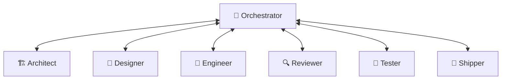

# Specification: Workflow Integration Test Page Outline

This document outlines the content and formatting of the new documentation file `docs/public/docs/tools/workflow-test.md`.

---

## Directory Location
- File path: `docs/public/docs/tools/workflow-test.md`

---

## Frontmatter Metadata
The page must start with the following frontmatter:
```yaml
---
sidebar_position: 3
---
```

---

## Content Structure & Markdown Outline

### 1. Header and Subtitle
- **H1 Header**: `# Workflow Integration Testing`
- **Lead Paragraph**: Summarizes what the guide is, why integration testing is crucial for multi-agent workflows, and how developers can execute this test suite manually or through automated subagents.

### 2. Workflow Sequence Visual (Mermaid Diagram)
Include a Mermaid flowchart to illustrate the hub-and-spoke flow and back-and-forth communication.


### 3. Step-by-Step Testing Pipeline

This section is divided into subsections for each role in the pipeline:

#### H2: `## 1. Orchestrator Discovery Phase`
- **Objective**: Initiate the session and create the Context Brief.
- **Inputs**: The initial user request or project concept.
- **Verification Steps**:
  1. Confirm the Orchestrator starts with the standard role prefix (`> 🎯 **Orchestrator**`).
  2. Verify that the Context Brief table is populated.
  3. Ensure a clear routing decision to the **Architect** is recommended.

#### H2: `## 2. Architect Specification Phase`
- **Objective**: Design the changes and create the spec files.
- **Inputs**: The Orchestrator's Context Brief.
- **Verification Steps**:
  1. Verify the `specs/changes/NNN-name/` directory is created.
  2. Confirm the existence and validity of `.spec.yaml`, `proposal.md`, `specs/`, `design.md`, and `tasks.md`.
  3. Ensure the Architect answers the 7 analysis questions.
  4. Verify the output follows the `Architect CLI Output` format.

#### H2: `## 3. Designer Specification Phase`
- **Objective**: Define visual style and layout structure (only if UI/UX is involved).
- **Inputs**: Spec folder created by the Architect.
- **Verification Steps**:
  1. Confirm the creation of `design.md` or visual specifications.
  2. Check theme/mode tokens and ASCII wireframes.
  3. Verify the output follows the `Designer CLI Output` format.

#### H2: `## 4. Engineer Implementation Phase`
- **Objective**: Implement specs, build the codebase, and write tests.
- **Inputs**: Technical specifications and tasks checklist.
- **Verification Steps**:
  1. Confirm the Engineer completes implementation according to `tasks.md`.
  2. Run the build/compile task.
  3. Execute unit and integration tests.
  4. Verify the output follows the `Engineer CLI Output` format.

#### H2: `## 5. Reviewer Quality Assurance Phase`
- **Objective**: Perform safety, security, and quality audit of code.
- **Inputs**: Target code diff and complete files.
- **Verification Steps**:
  1. Verify the Reviewer reviews the full files, not just diffs.
  2. Check for security risks, secret leaks, and console logs.
  3. Ensure the verdict is clearly stated (`PASS`, `PASS WITH WARNINGS`, or `FAIL`).
  4. Verify the output follows the `Reviewer CLI Output` format.

#### H2: `## 6. Tester Validation Phase`
- **Objective**: Test layout correctness, responsiveness, and verify user criteria.
- **Inputs**: Implemented page or visual code.
- **Verification Steps**:
  1. Check page functionality and layout rendering.
  2. Validate links, headers, and metadata.
  3. Check console logs for errors.

---

### 4. Integration Test Success Criteria (Table)
Provide a table summarizing the expected deliverables and verification method for each skill phase:

| Phase | Main Deliverable | Verification Tool/Action |
|---|---|---|
| **Orchestrator** | Context Brief | Check table correctness and routing output |
| **Architect** | Spec Files Folder | Lint YAML and verify file presence |
| **Designer** | UI/UX Visual Spec | Check theme tokens and ASCII layout |
| **Engineer** | Completed Code & Tests | Run compile and execution tests |
| **Reviewer** | Quality Report | Review code diff coverage & security threats |
| **Tester** | Visual/Functional Verification | Manual page test & link sanity |
